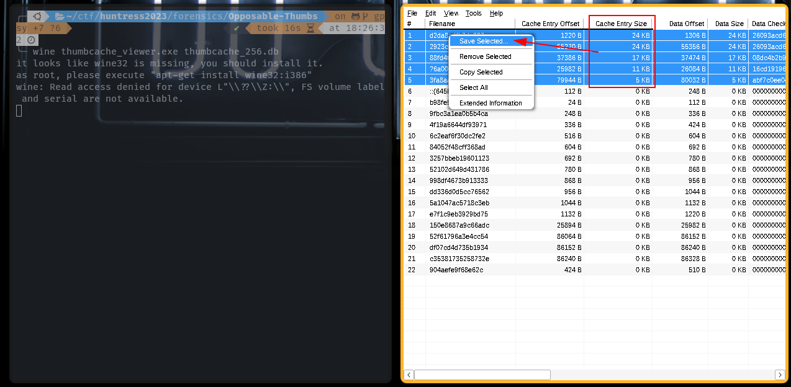
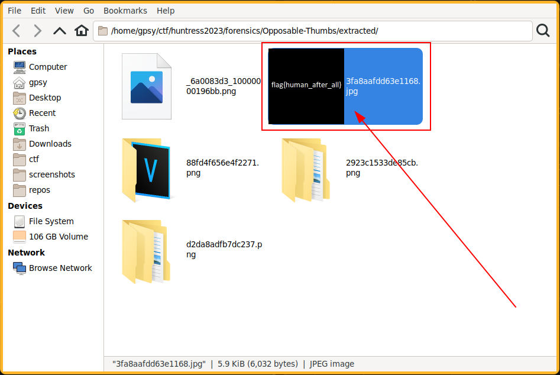

# ✅ FORENSICS - Opposable Thumbs

Writeup by: [@goproslowyo](https://github.com/goproslowyo)

## Tags

- easy

Files:

- [thumbcache_256.db](./thumbcache_256.db)

## Description

Author: @JohnHammond

We uncovered a database. Perhaps the flag is right between your fingertips!  NOTE: this flag does NOT follow the standard MD5 hash format, but does have the usual `flag{}` prefix and suffix.  Download the file(s) below.

## Writeup

We get a .db file which seems like a Microsoft thumbnail database file. We can try to use [Thumbcache Viewer](https://thumbcacheviewer.github.io/) to see what's inside.

I'm on a Linux machine so I ran the program using Wine. Your mileage may vary.

`wine thumbcache_viewer.exe thumbcache_256.db`

We can see a number of non-zero sized files so let's extract them to take a look.

Looking at the extracted files we can easily see the flag:

`flag{human_after_all}`
