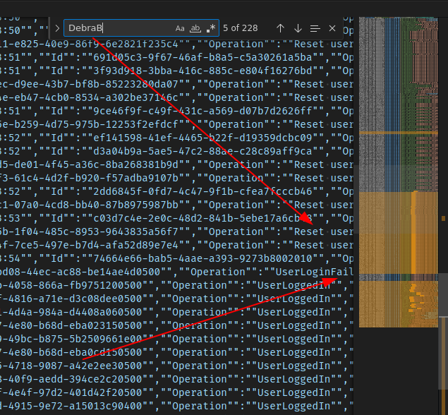
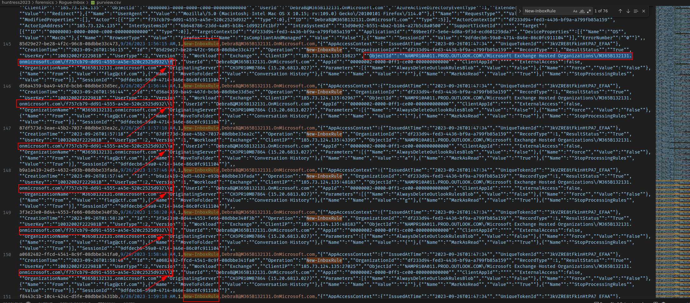

# ✅ FORENSICS - Rogue Inbox

Writeup by: [@goproslowyo](https://github.com/goproslowyo)

## Tags

- medium

Files:

- [purview.csv](./purview.csv)

## Description

Author: @squiggles

You've been asked to audit the Microsoft 365 activity for a recently  onboarded as a customer of your MSP.  Your new customer is afraid that Debra was compromised. We received logs exported from Purview... can you figure out what the threat actor did? It might take some clever log-fu!  Download the file(s) below.

## Writeup

This challenge involves reading through some activity logs from a MS365 tenant to find some malicious activity. Scanning through the log file we don't see too much interesting things but we're given a hint that `debra`'s account may have been compromised so I started with a quick search for the user in the logs and scanned lines that they were involved in. There were a few lines that stuck out from a pattern in VSCode that struck me:

Of the events containing Debra's account there are a large number of `New-InboxRule` events that appear disproportionately compared to many of the other events... And, wouldn't you know if, glancing at the objectId that one of the log lines references shows us a letter, `f`, that we might be interested in.... Do you see the rest of the flag in the pattern? Now just extract the flag and submit it.

`flag{24c4230fa7d50eef392b2c850f74b0f6}`
