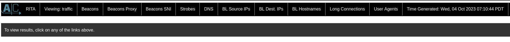
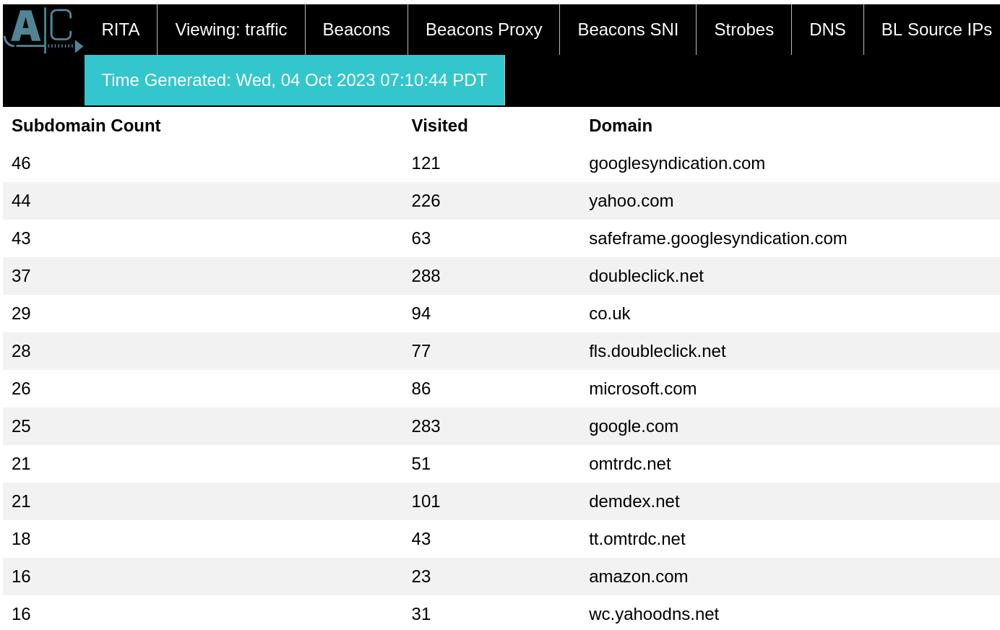
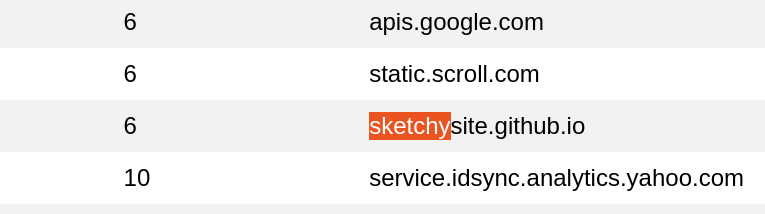

# ✅ FORENSICS - Traffic

| Key    | Value |
| ------ | ----- |
| ID     | 8     |
| Solves | 0     |
| Value  | 500   |

Writeup by: [@goproslowyo](https://github.com/goproslowyo)

## Tags

- medium

Files:

- [traffic.7z](https://huntress.ctf.games/files/efd8115eedbda53848676208e38e6afc/traffic.7z?token=eyJ1c2VyX2lkIjozMTgyLCJ0ZWFtX2lkIjo0MDcsImZpbGVfaWQiOjd9.ZR1iEA.mAP4vLQHG_wQfAMj1N5zdmzf7ZQ)

## Description

Author: @JohnHammondWe saw some communication to a sketchy site... here's an export of the network traffic. Can you track it down? Some tools like `rita` or `zeek` might help dig through all of this data! Download the file below.

## Writeup

This challenge involved analyzing some network traffic capture with zeek.

We can begin by getting the latest RITA binary from their github page. We also need to have a _very specific_ version of mongodb, because why should security tools stay up to date?

From there we can extract the zeek traffic archive and import it into RITA and then generate an HTML report to look at.

```bash
$ curl -LO https://github.com/activecm/rita/releases/download/v4.8.0/rita
$ chmod +x ./rita
$ docker run --rm --name mongo-for-rita -dp 27017:27017 mongo:4.2.24
$ 7z x traffic.7z
$ ./rita import 2021-09-08 traffic
$ ./rita html-report traffic
[...]
```

The challenege description hints that there was traffic to a `sketchy` site. :facepalm:

We can go through the RITA data using the tabs above and after a while you might spot something amiss.







And visit the sketchysite to claim your flag:

`flag{8626fe7dcd8d412a80d0b3f0e36afd4a}`


