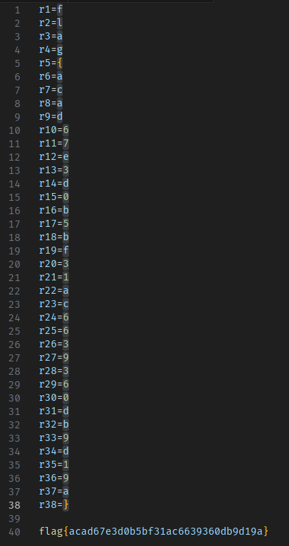

# ✅ MALWARE - Batchfuscation

Writeup by: [@goproslowyo](https://github.com/goproslowyo)

## Tags

- medium

Files:

- [batchfuscation](./batchfuscation)

## Description

Author: @JohnHammond

I was reading a report on past Trickbot malware, and I found this sample that looks a lot like their code! Can you make any sense of it?  Download the file below.

## Writeup

This one is just an onion of deobfuscation. Let's start off with the top few variables.

```shell
set bdevq=set
%bdevq% grfxdh=
%bdevq%%grfxdh%mbbzmk==
%bdevq%%grfxdh%xeegh%mbbzmk%/
%bdevq%%grfxdh%jeuudks%mbbzmk%a
%bdevq%%grfxdh%rbiky%mbbzmk%c
%bdevq%%grfxdh%wzirk%mbbzmk%m
%bdevq%%grfxdh%naikpbo%mbbzmk%d
%bdevq%%grfxdh%ltevposie%mbbzmk%e
%bdevq%%grfxdh%uqcqswo%mbbzmk%x
%bdevq%%grfxdh%zvipzis%mbbzmk%i
%bdevq%%grfxdh%kquqjy%mbbzmk%t
%bdevq%%grfxdh%kmgnxdhqb%mbbzmk%

becomes

set bdevq=set
set grfxdh=
set mbbzmk==
set xeegh=/
set jeuudks=a
set rbiky=c
set wzirk=m
set naikpbo=d
set ltevposie=e
set uqcqswo=x
set zvipzis=i
set kquqjy=t
set kmgnxdhqb=
```

Now we have our first "key" to replace against the rest of the file.

After replacing all instances in the file you're left with a top section of 200 lines that look like the following:

```batch
set /a bpquuu=4941956 %% 4941859
cmd /c exit %bpquuu%
set grtoy=%=exitcodeAscii%
set /a fqumc=9273642 %% 9273544
cmd /c exit %fqumc%
set kbhoesxh=%=exitcodeAscii%
set /a uhtsvvtj=9196704 %% 9196605
cmd /c exit %uhtsvvtj%
[...]
```

We can add this code to our own batch script and run it to get our second key.


We need to clean up the output a bit and we get:

```shell
set grtoy=a
set kbhoesxh=b
set fxflckau=c
set pxesvvz=d
set aeawgno=e
set vdqvoyxss=f
set mljmage=g
set dtqahrd=h
set xrghxw=i
set rvrcd=j
set cxqemy=k
set djkxbuskp=l
set auuhztfa=m
set znvbyce=n
set exoypdqzg=o
set upogfi=p
set xulqq=q
set jxiczrrc=r
set qihgjzq=s
set ldawonn=t
set edefpb=u
set giknplvpv=v
set fbvra=w
set klerqtt=x
set puufauef=y
set lhuzd=z
set iwwna=A
set ilajhm=B
set hzsouxmm=C
set dqutqsgb=D
set jkkvc=E
set ioexkmd=F
set jmcpbpld=G
set udpmq=H
set rbijdi=I
set qzpkv=J
set ikedxdamk=K
set stcjm=L
set majmn=M
set utjscfnmq=N
set bpxroxnqg=O
set hrleb=P
set wzprdlp=Q
set fikmapqe=R
set lwuwiovpd=S
set lftuiqz=T
set vogsuisdx=U
set bsslmcgic=V
set oyyfmilg=W
set lhniwqwff=X
set nvfosjl=Y
set ajexk=Z
set flopojsse=0
set tqjmbt=1
set wpwjwymw=2
set wxkugd=3
set fxqik=4
set zygcfg=5
set remydays=6
set ztvra=7
set yqdie=8
set lzyqwgi=9
set koimdqluu={
set tleci=}
set vgysuv=?
set xpjaysvii=:
set nvsna=.
set vrzatob==
set orutn=,
set hmjhafbu=_
```

We can now use this key to decode the rest of the obfuscate batch script.

A few things that might help speed you up in CTF competition. The set of chars for the flag is `[}lag{0-9a-f]` so you can probably skip over the uppercase and non-hex characters to start with. If you do you might slowly start noticing you can find a useful string...


From here I just pulled out all 38 strings that looked like this, sorted them properly, and claimed my flag.



`flag{acad67e3d0b5bf31ac6639360db9d19a}`
