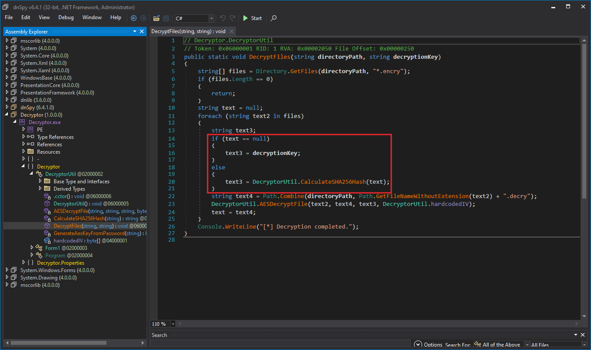
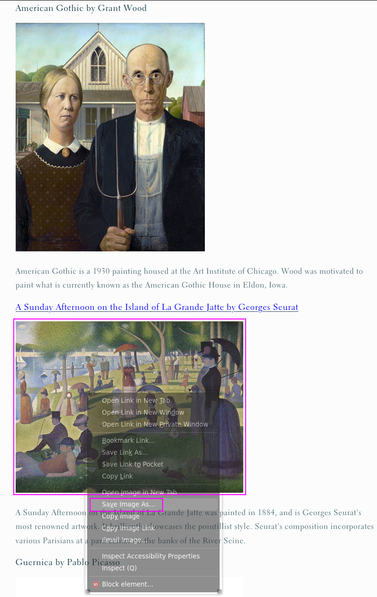
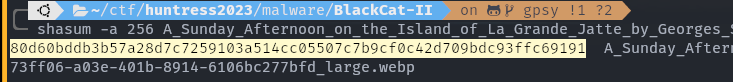
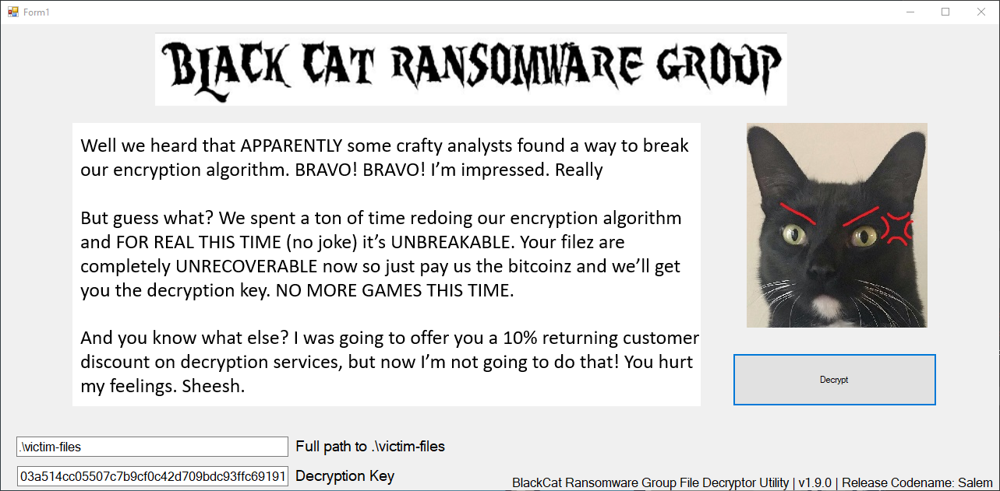
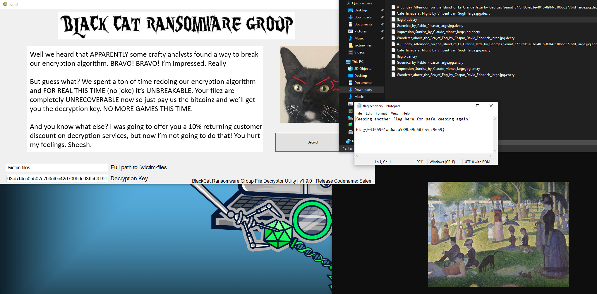

# ✅ MALWARE - BlackCat II

Writeup by: [@goproslowyo](https://github.com/goproslowyo)

## Tags

- hard

Files:

- [blackcatII.7z](./blackcatII.7z)

## Description

Author: @HuskyHacks

Be advised analyst: BlackCat is back! And they're mad. Very mad.
Help our poor user recover the images that they downloaded while browsing their favorite art site. Quickly!    Archive password: `infected`   NOTE, this challenge is based off of a real malware sample. Windows Defender will probably identify it as malicious. It is strongly encouraged you only analyze this inside of a virtual environment separate from any production devices. Password: infected   Download the file(s) below.

## Writeup

Ooooof this one was a tricky one. A quick look at the decryptor.exe file in dnSpy shows us the decryption scheme uses a "password" first and then to decrypt each sucessive file the sha256sum from the previously decrypted file is used.

Aha, so this is more like an OSINT challenege. We should try to find these originals and get the sha256 of them and see if any of them let us decrypt the files.

`A_Sunday_Afternoon_on_the_Island_of_La_Grande_Jatte_by_Georges_Seurat_5773ff06-a03e-401b-8914-6106bc277bfd_large.jpg.encry` is quite a specific image name such that if we found the "original" we should see that same name when we "Right-click, Save Image As..." on the file and that would confirm we correctly OSINTed the original file.

I finally found the [originals here](https://www.atxfinearts.com/blogs/news/100-most-famous-paintings-in-the-world).

I had to EXPLICITLY save the image with `Firefox`. If I used `curl`, `wget`, `Invoke-WebRequest`, `Chrome`, etc I got a totally wrong hash. YMMV.

So I used `Firefox`, copied the image link, saved that image (which, btw was a WEBP _NOT_ a JPG!)...

...and took the md5sum of _THAT_ file which we can use...

...to decrypt the `flag.txt.decry` file...

and get the flag.

`flag{03365961aa6aca589b59c683eecc9659}`

---

I included [the original](./A_Sunday_Afternoon_on_the_Island_of_La_Grande_Jatte_by_Georges_Seurat_5773ff06-a03e-401b-8914-6106bc277bfd_large.webp) `A_Sunday_Afternoon_on_the_Island_of_La_Grande_Jatte_by_Georges_Seurat_5773ff06-a03e-401b-8914-6106bc277bfd_large.webp` file in case it goes off the internet to use for generating an md5sum.
