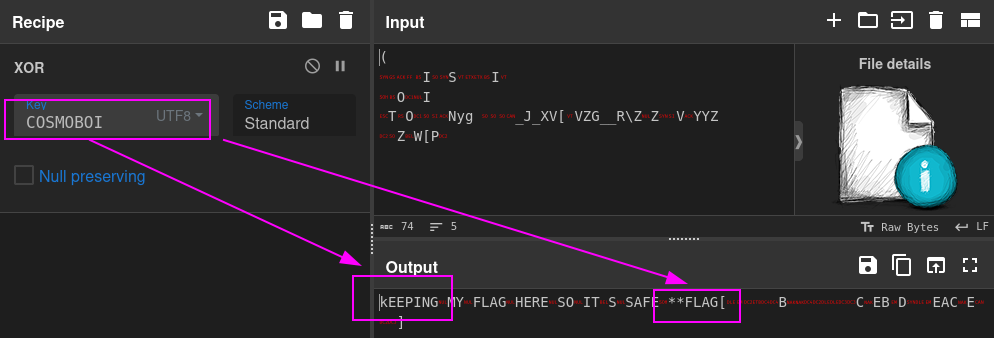
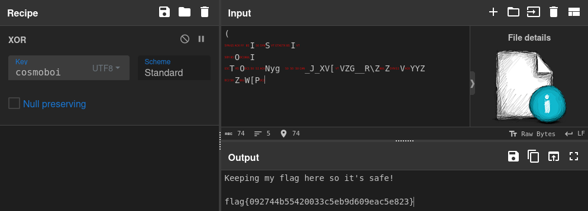
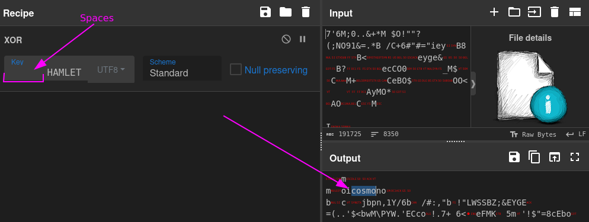
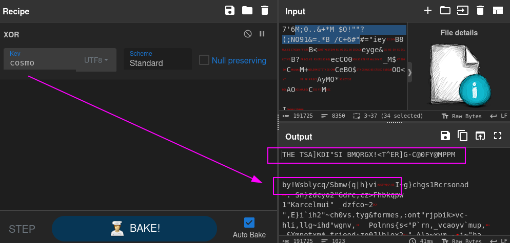
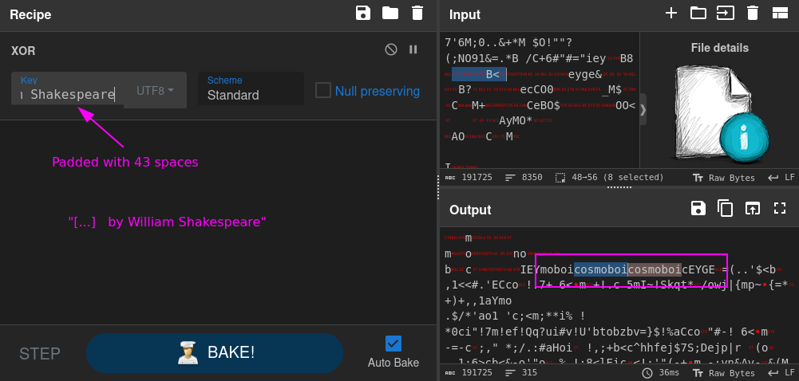

# ✅ MALWARE - BlackCat

Writeup by: [@goproslowyo](https://github.com/goproslowyo)

## Tags

- easy

Files:

- [blackcat.7z](./blackcat.7z)

## Description

Author: @HuskyHacks

We've been hit by the infamous BlackCat Ransomware Group! We need you to help restore the encrypted files. Please help! My favorite rock got encrypted and I'm a wreck right now!  Archive password: `infected`   NOTE, this challenge is based off of a real malware sample. Windows Defender will probably identify it as malicious. It is strongly encouraged you only analyze this inside of a virtual environment separate from any production devices.   Download the file(s) below.

## Writeup

This challenge involves reversing the encryption of our files using a cipher key. We have some known plaintext files we can use to do a brute force against.

A quick tell for this CTF challenge was we can find the cipher key at the end of one of these files:

```shell
$ tail -2 the-entire-text-of-hamlet.txt.encry
O       I


         iOSMOBOICOSMOBOICOSMOBOICOSMOBOICOSMOBOICOSMOBOICOSM
IO      MOSgeh;!&O6#+%
```

Interesting... `COSMOBOI`.

Let's throw that in CyberChef and see.



Looks like the text we decrypted is just SHIFTed `kEEPING` vs `Keeping`. So let's lowercase the key and try again.



There's our flag.

`flag{092744b55420033c5eb9d609eac5e823}`

----

There's a real way you can try to decrypt this using the known plaintext though. That method is called crib dragging.





Oh, hey. Some of that text looks like "by William Shakespeare" doesn't it? Let's try that as our key padded with as many spaces as it takes to get to that part of the text (43 characters/spaces).



Oh look, our key appears. We can use that key `cosmoboi` to get the flag, same as documented above.
