# ✅ MALWARE - Crab Rave

Writeup by: [@goproslowyo](https://github.com/goproslowyo)

## Tags

- hard

Files:

- [crab_rave_easier.7z](./crab_rave_easier.7z)
- [crab_rave_harder.7z](./crab_rave_harder.7z)

## Description

Author: @HuskyHacks

My biologist friend told me that everything eventually evolves into a crab-like form.  I don't know if that's true but I guess malware authors got a head start on that evolution.  To save you some time, I went ahead and found you the 10 hour extended version of Crab Rave on YouTube  (https://www.youtube.com/watch?v=-50NdPawLVY). You'll need it.  So, here's the deal. This one is tough, so we're giving you a "Choose Your Own Adventure" challenge.  Are you super confident with reverse engineering? Try `crab_rave_harder.7z`. Not so confident with RE? We gave you `crab_rave_easier.7z`.  Both have the same flag. Both do the same thing. If you solve one, you solve both. No matter which one you go with, it will be challenging. You got this.   Archive password: `infected`   NOTE, this challenge is based off of a real malware sample. Windows Defender will probably identify it as malicious.  It is strongly encouraged you only analyze this inside of a virtual environment separate from any production devices.
Download the file(s) below.

## Writeup

This is a Windows DLL file written in Rust. We'll need to reverse engineer it to figure out what it's doing.

First we find the call to `DLLMain` and see that it's making a call to `NtCheckOSArchitecture`.

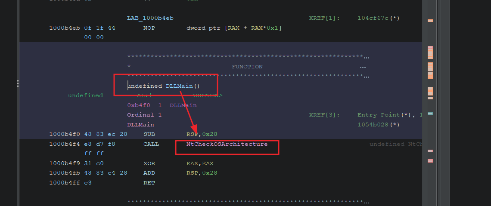

In `NtCheckOSArchitecture` we see that there are some parameters being passed into a function called `decrpyt_bytes` that's apart of the [litcrypt](https://github.com/anvie/litcrypt.rs/blob/2f3c75e9527076a151f08b4ec438799a027ee985/src/litcrypt.rs#L159-L164) rust crate.

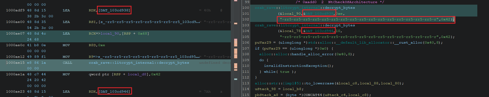

```rust
pub fn decrypt_bytes(encrypted: &[u8], encrypt_key: &[u8]) -> String {
    let decrypted = xor(&encrypted[..], &encrypt_key);
    String::from_utf8(decrypted).unwrap()
}
```

Nice! It's just a simple XOR so we should be able to reverse all the XOR'd strings we're interested in. Let's pull out all the byte strings and prepare to reverse them. We can select all the bytes, right click, and select `Copy Special...`.

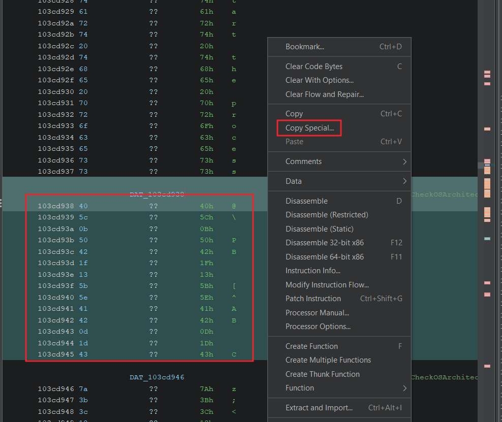

Then choose `Byte String` or `Byte String (No Spaces)`.

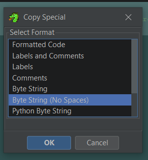

We know the XOR key, shown in the function call, `-rr5-rr5-rr5-rr5-rr5-rr5-rr5-rr5-rr5-rr5-rr5-rr5-rr5-rr5-rr5-rr5-r`.

- [Username decoded in CyberChef](https://gchq.github.io/CyberChef/#recipe=From_Hex('Line%20feed')XOR(%7B'option':'UTF8','string':'-rr5-rr5-rr5-rr5-rr5-rr5-rr5-rr5-rr5-rr5-rr5-rr5-rr5-rr5-rr5-rr5-r'%7D,'Standard',false)&input=NDA1YzBiNTA0MjFmMTM1YjVlNDE0MjBkMWQ0Mw)

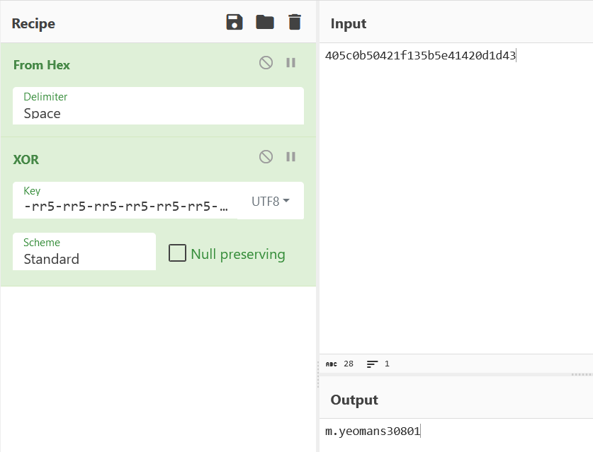

- [Hostname decoded in CyberChef](https://gchq.github.io/CyberChef/#recipe=From_Hex('Line%20feed')XOR(%7B'option':'UTF8','string':'-rr5-rr5-rr5-rr5-rr5-rr5-rr5-rr5-rr5-rr5-rr5-rr5-rr5-rr5-rr5-rr5-r'%7D,'Standard',false)&input=N2EzYjNjMTg2OTM3MjQxODFjNDE)

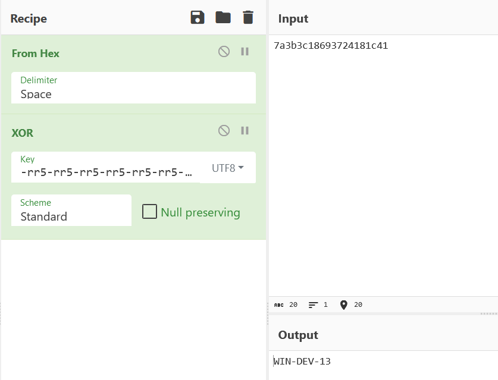

- [Some executable name decoded in CyberChef](https://gchq.github.io/CyberChef/#recipe=From_Hex('Line%20feed')XOR(%7B'option':'UTF8','string':'-rr5-rr5-rr5-rr5-rr5-rr5-rr5-rr5-rr5-rr5-rr5-rr5-rr5-rr5-rr5-rr5-r'%7D,'Standard',false)&input=NDMxZDA2NTA1ZDEzMTYxYjQ4MGExNw)

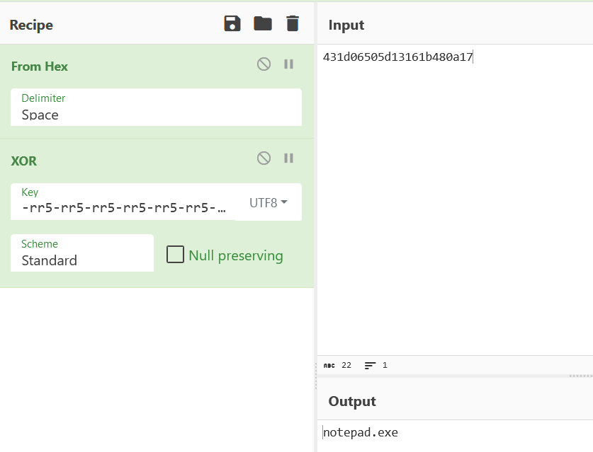

- [A GitHub Gist URL decoded in CyberChef](https://gchq.github.io/CyberChef/#recipe=From_Hex('Line%20feed')XOR(%7B'option':'UTF8','string':'-rr5-rr5-rr5-rr5-rr5-rr5-rr5-rr5-rr5-rr5-rr5-rr5-rr5-rr5-rr5-rr5-r'%7D,'Standard',false)&input=NDUwNjA2NDU1ZTQ4NWQxYTRhMWIwMTQxMDMxNTFiNDE0NTA3MTA0MDVlMTcwMDU2NDIxYzA2NTA0MzA2NWM1NjQyMWY1ZDdkNTgwMTE5NGM2NTEzMTE1ZTVlNWQ0YTU2NDgxMTE3MGQxYTRhMTQ1MTQ4NDQ0MzAwNDgxNDRhMDIxYTQyMWQ0NzRiNTExNTRhNDAwNDFjMTA0MDUwMDIwMDEzNDIwMjEzMTA1NjRjMTQ0NzBjMWY0MjEzMDExZDRhNDYwNjE1NDc0MzUwNDgxMTQ3MDAxZDE2NDM1MTRlMTM0YjAyNDg0YjQ2MDExOTEzMTEwMjE4NWQxNTVjNWUwNjE0NWM0MTE3MWM1YzA2NGQ1OQ)

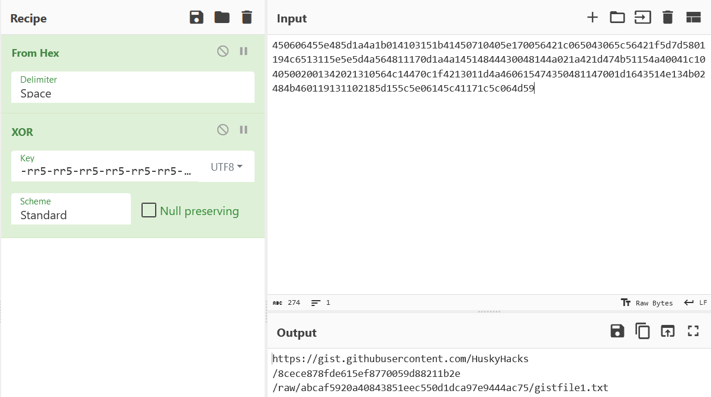

Visiting the Gist URL we find what looks be base64 but decoding it doesn't give us an intelligible string. If we look deeper at the `inject_flag` function we can see the base64 decoded text is then passed to AES256 decrypt... aha! We've also got to decrypt the string and thankfully we can see the key and IV in the decompiled code as well. So let's give it a try.

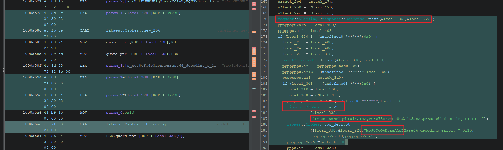

Load the string into CyberChef, base64 decode it, and the run it through the AES decryption tool. Here's the [CyberChef recipe](https://gchq.github.io/CyberChef/#recipe=From_Base64('A-Za-z0-9%2B/%3D',true,false)AES_Decrypt(%7B'option':'UTF8','string':'rAcbUUWWNFlqMbruiYOIsAyVQHS78orv'%7D,%7B'option':'UTF8','string':'MoJ8C6O4D3asAApB'%7D,'CBC','Raw','Raw',%7B'option':'Hex','string':''%7D,%7B'option':'Hex','string':''%7D)&input=bzJXQi9lSGgzcytTeGdSNFFVakU5ZjB5QXQ0QzE2b0hadmFjbEtsbUJvNEsxYnNWU2JWUzJmanhqYW8vWVZVR3Y3djdPbTV4a0RqWHhBUmpGNkFaYWxONnBFTlNnVkJRSXJZZk1xK1ZlQnd3UjF3aEZXUkdJQytxdWxHNkhEWW1mWnQ2VmE0aWxqeWxqeGJTblpNcnhRd1dVWEpEaEVqdTJpVnpzYTFsNm5Gem9IV08rNStwRFY4K3NMbjNQOWpoZlpFN3FMS1ZPdDdMbS9zdFNCV1pEZ3p1dnFwWnppQllvNUV1bWRySVNZdldrTW01VDJaRDdpUlNRYUozSHI5TFVkMG5PbmZWTFcyQ3lMTm1xQU0vQktjMGY1QTlZQW9HSVNteW1qYytjYW1VTHBDaVM0V29JOENpeUJLT1hyNUszQ1FneDBPOW5PbjhhUzJJVTdScmVPb3BIMDhFR09ONkRCemtJd2JxcEM5bzI4QSt3TlpzYzZjSkMwQXBsSVVBYWZkT05CbGcvTm1jU21rT25QT0FSL3FoTUdNbFpLdHpFcWk0UlpEek9mbz0).

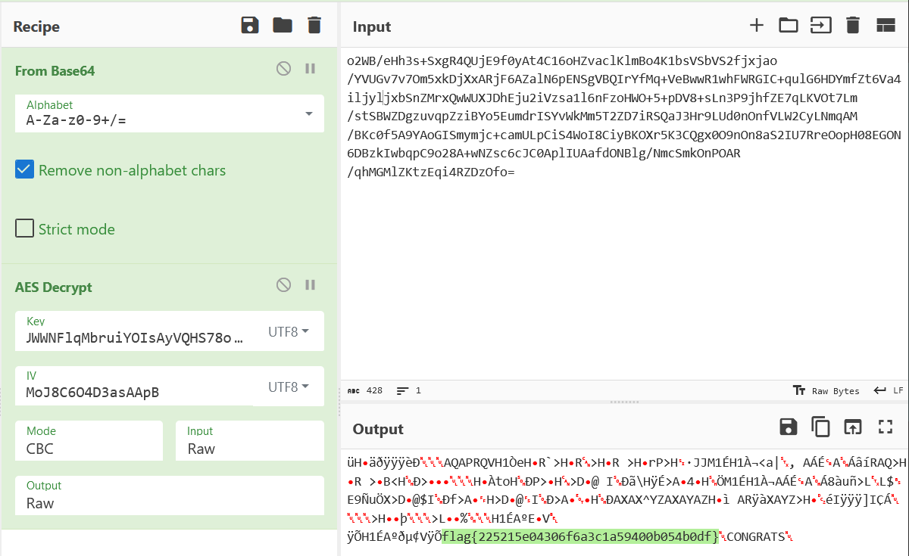

`flag{225215e04306f6a3c1a59400b054b0df}`

----

Those strings we decoded earlier, the username and hostname, incidentally, can be used to also get the flag. If you set the hostname, and run the binary as that user, you'll get a popup with the flag. (Might not be the best approach with _real_ malware ;) unless you're REALLY trying to analyze it's behavior.)

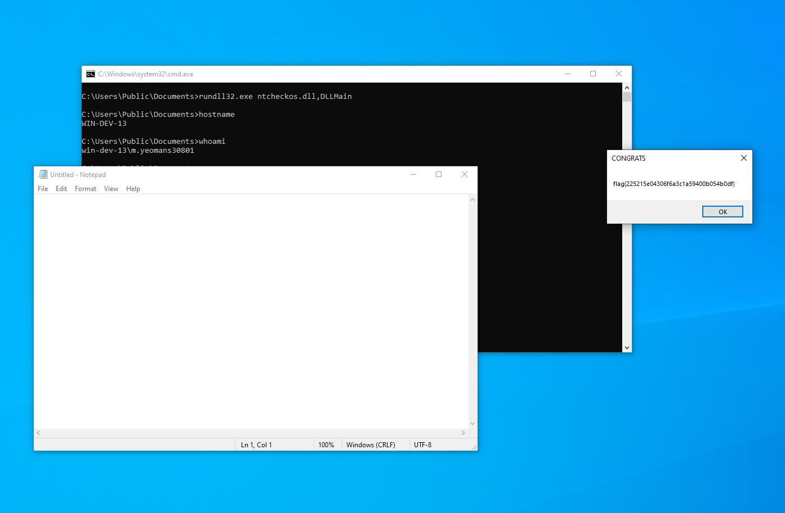
