# ✅ MALWARE - Snake Eater II

Writeup by: [@goproslowyo](https://github.com/goproslowyo)

## Tags

- medium

Files:

- [snake_eaterII.7z](./snake_eaterII.7z)

## Description

Author: @HuskyHacks

Snake Eater II - Revenge of the Snake Eater  The Threat Actor must have gotten word that you had no trouble dissecting Snake Eater. They said this one is a bit more... involved.  Archive Password: `infected`   NOTE, this challenge is based off of a real malware sample. Windows Defender will probably identify it as malicious. It is strongly encouraged you only analyze this inside of a virtual environment separate from any production devices.   Download the file(s) below.

## Writeup

This challenge was revenge from the first Snake Eater challenge. It's another PyArmor-obfuscated self-extracting PyInstaller Windows executable. Let's just skip the whole pyinstxtractor / pycdc hullaballoo and jump straight into reversing this thing.

For starters, just running `snake_eaterII.exe`  and viewing it in `Sysinternals Process Monitor` showed some really interesting things. First thing I noticed is that it looks like it was randomly choosing a folder under `%APPDATA%`. Next, it was calling WriteFile on a file called `tmp.txt` one byte in size followed by `flag.txt` thirty-eight bytes in size. Aha, flag sized! But then we can see it immediately deletes the file. Hmm.

Let's set some filters to clean up the output.

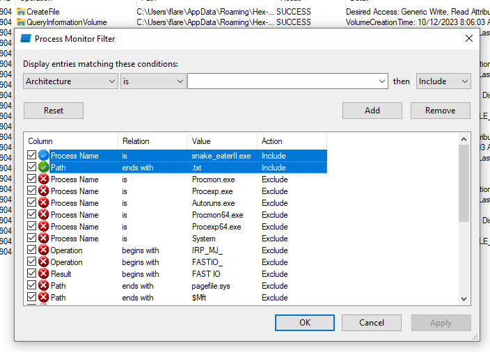

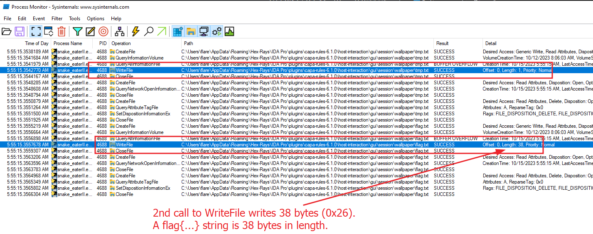

I'd normally try debugging/reversing in cutter but it doesn't have the ability to follow child processes and in this case the binary actually calls `CreateProcess` and we'd really like to debug that process.

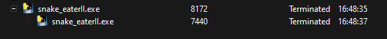

So, let's go over to WinDbg and load the executable for debugging.

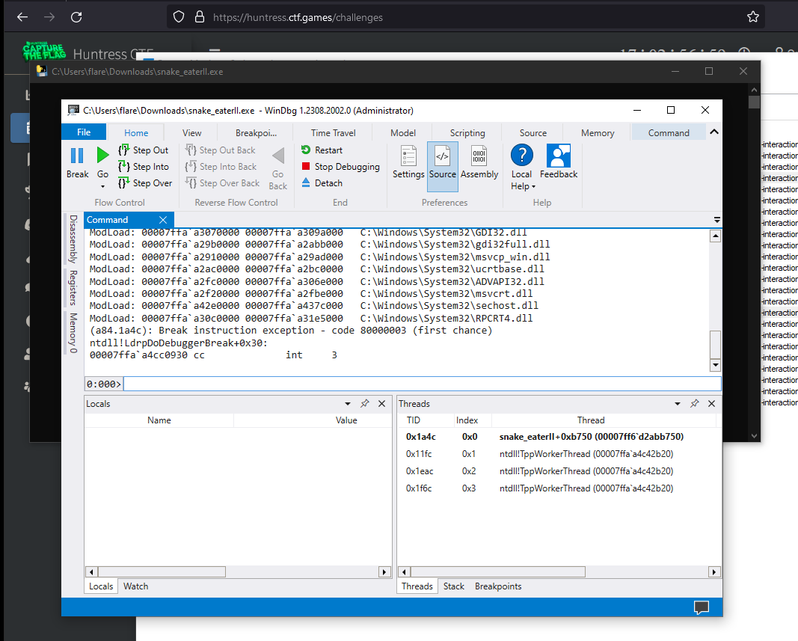

Next, we'll use `.childdbg 1;gc` to enable debugging child processes and continue the execution.

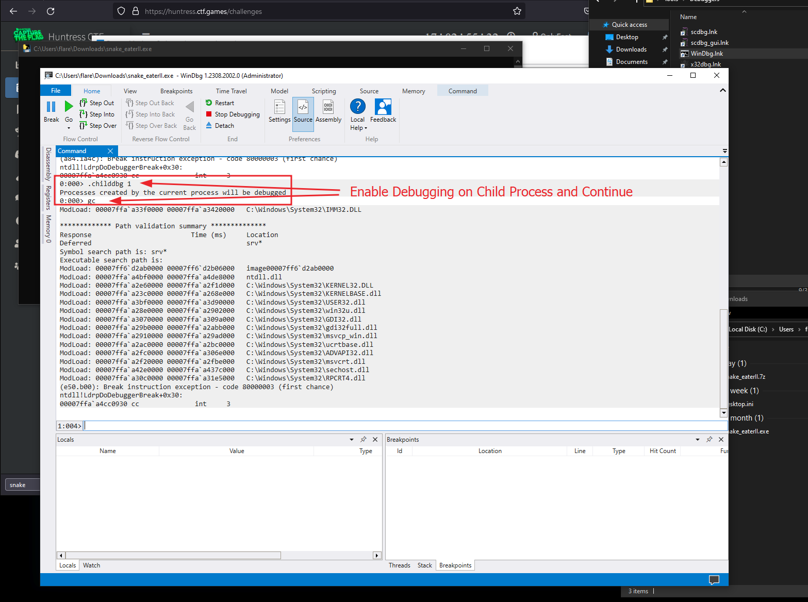

Next, we'll break on `WriteFile` in kernel32.dll and just echo it out. We want to inspect the registers on our second break (if you recall the `WriteFile` calls we saw previously in the `ProcMon` screenshots).

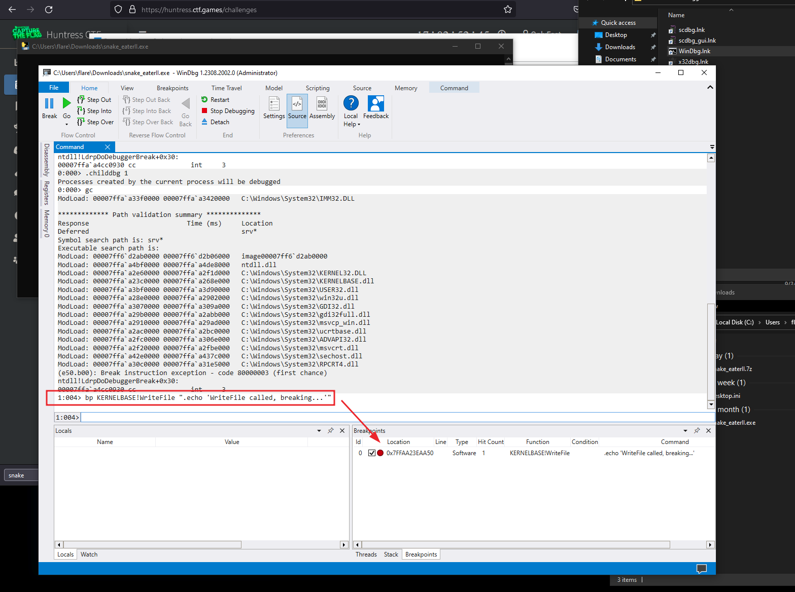

Now, let's take a second to learn about (or recall) what we know about x64 calling conventions and the `WriteFile` function and what parameters are which. What is important to see here is that the registers used for storing the parameters to the function call are `RCX`, `RDX`, `R8`, `R9`.

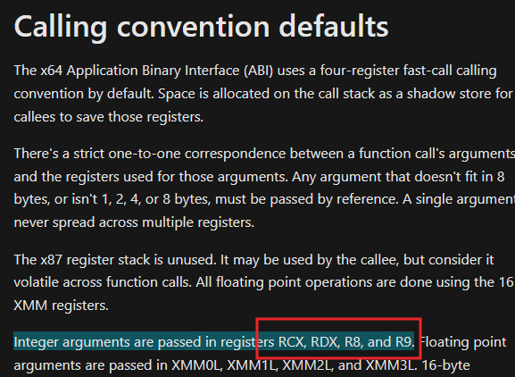

The next important thing to check is the parameters to `WriteFile`. We're interested in `RDX` which is `lpBuffer` and `R8` which is `nNumberofBytesToWrite`. Do you see how those line up? Great.

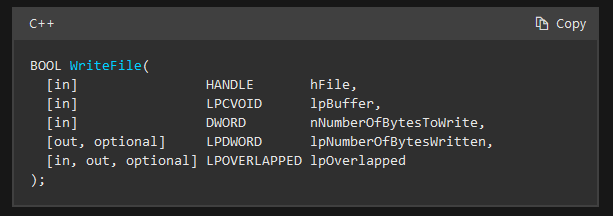

Knowing this information, the next time we come around to the breakpoint we can inspect the registers `R8` should contain `0x26` which is the `38 bytes` or the size of our flag and `RDX` should literally contain the raw flag bytes.

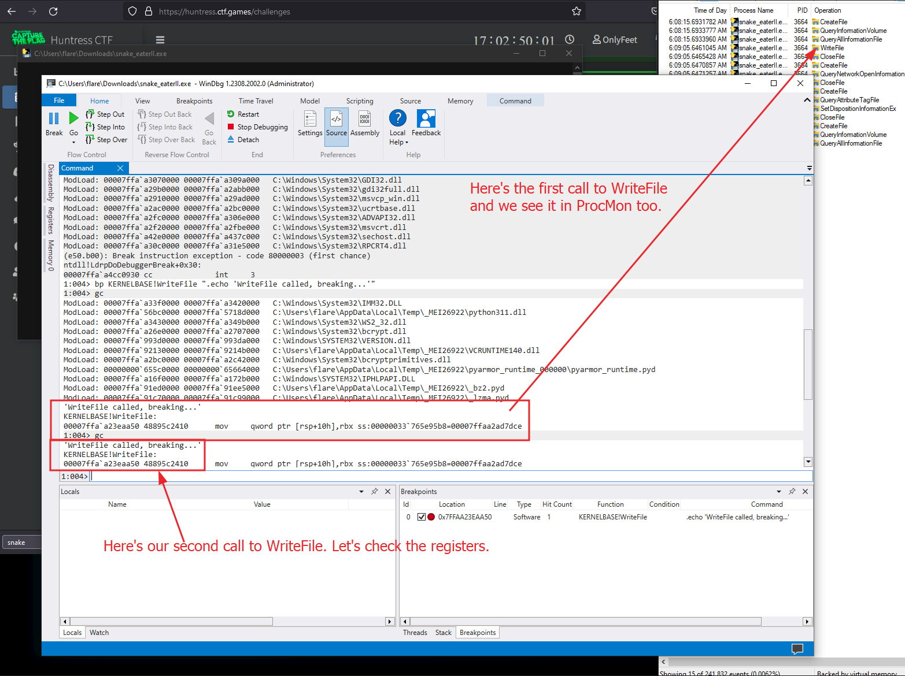

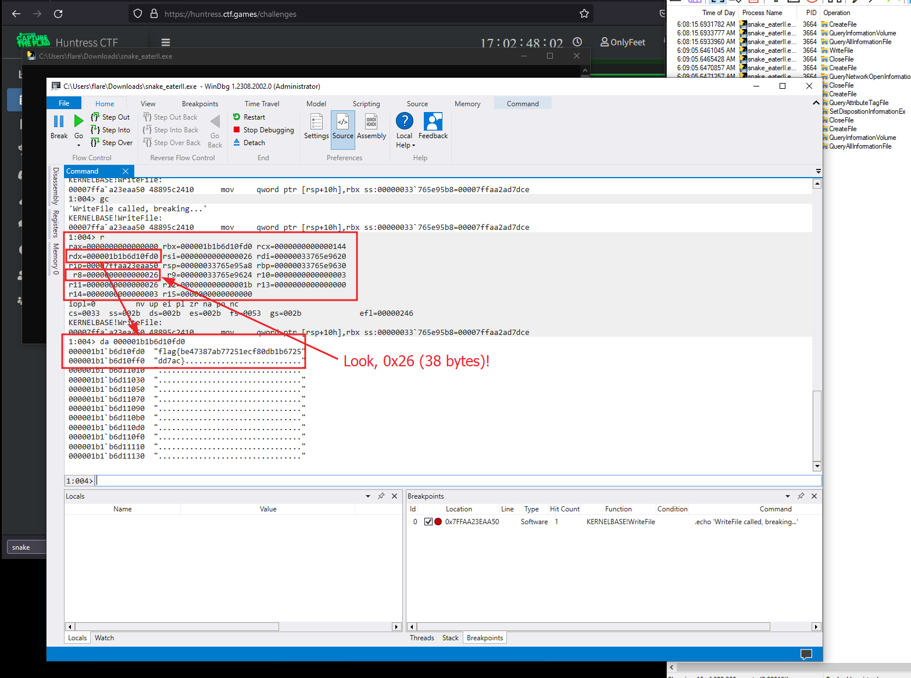

The flag:

`flag{be47387ab77251ecf80db1b6725dd7ac}`

---

We can use this series of WinDbg commands to print the flag with basically a one-liner:

`.childdbg 1;gc;bp KERNELBASE!WriteFile ".echo 'WriteFile called, breaking...'";gc;gc;r;da rdx L26;`

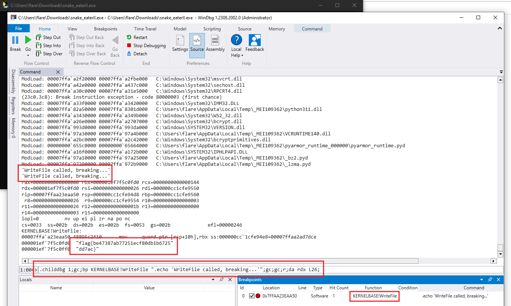
