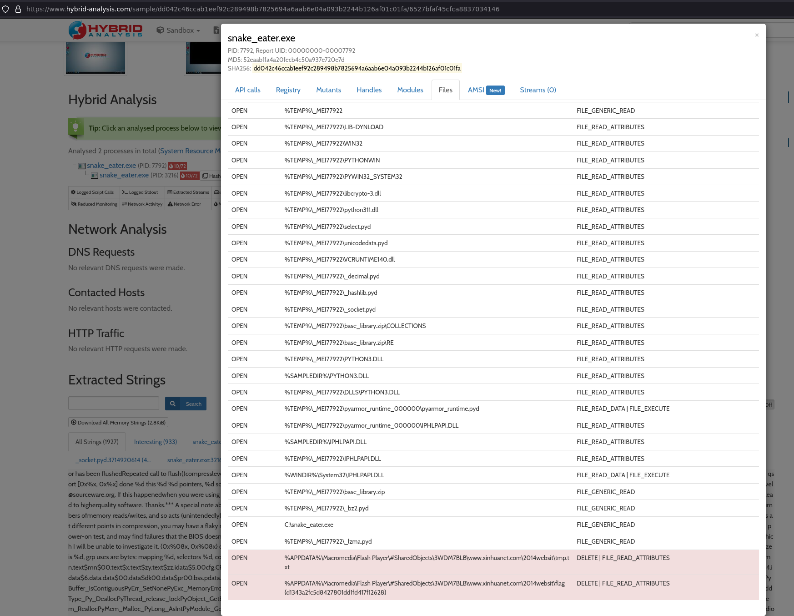
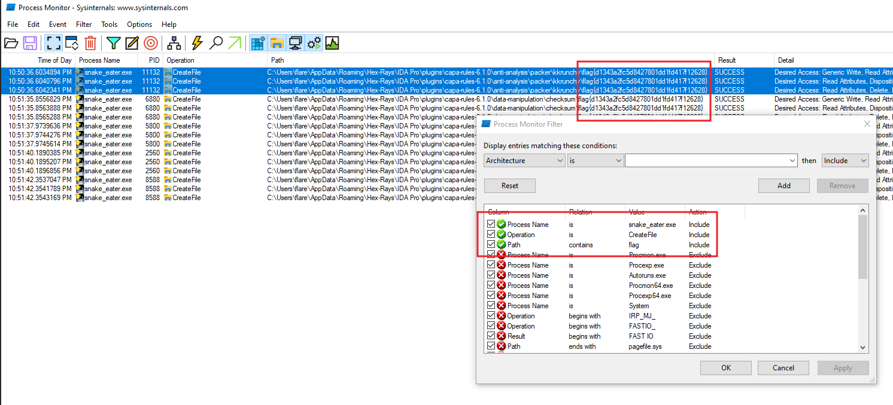
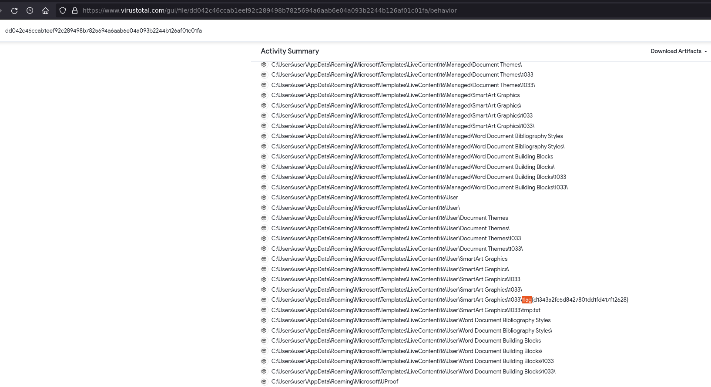

# ✅ MALWARE - Snake Eater

Writeup by: [@goproslowyo](https://github.com/goproslowyo)

## Tags

- easy

Files:

- [snake_eater.7z](./snake_eater.7z)

## Description

Author: @HuskyHacks

Hey Analyst, I've never seen an executable icon that looks like this. I don't like things I'm not familiar with. Can you check it out and see what it's doing?  Archive password: `infected`   NOTE, this challenge is based off of a real malware sample. Windows Defender will probably identify it as malicious. It is strongly encouraged you only analyze this inside of a virtual environment separate from any production devices.   Download the file(s) below.

## Writeup

This was a pretty neat, quick, and easy malware forensics challenge.

To start you're given snake_eater.exe. I first noticed it was a python self-extracting file or pyinstaller. Initially I went down a rabbit hole by extracting all the python files and found `snake_eater.pyc` I started trying to decompile this but ending up at a dead-end with `pyarmor` protected files.

I think easier than reversing PyArmor would be to move on to dynamic analysis of the file. That lead almost immediately to the flag since the malware tries to read, create, and delete a number of files that have the flag as the name.

I opted for quick dynamic analysis using `hybrid-analysis.com` given that it was a CTF and I just wanted to find the flag ASAP. You can see in the screenshot I noticed the malware trying to delete a file w/ a name containing the flag.

_*HOWEVER*_, you would have also seen this from some analysis with Process Monitor and a few more filters. You can start with a simple filter of process name is `snake_eater.exe` and that is already enough for you to see the flag if you scroll around and search. But here's a more direct filter:

---

[Virustotal also worked.](https://www.virustotal.com/gui/file/dd042c46ccab1eef92c289498b7825694a6aab6e04a093b2244b126af01c01fa/details)

`flag{d1343a2fc5d8427801dd1fd417f12628}`
