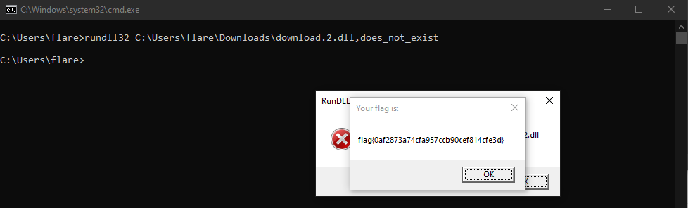

# ✅ MALWARE - Thumb Drive

Writeup by: [@goproslowyo](https://github.com/goproslowyo)

## Tags

- medium

Files:

- [ADATA_128GB.lnk](https://huntress.ctf.games/files/9c2e09e8938353390ae451d3ff454d2f/ADATA_128GB.lnk?token=eyJ1c2VyX2lkIjozMTgyLCJ0ZWFtX2lkIjo0MDcsImZpbGVfaWQiOjQ3fQ.ZTEpsQ.hZ2jrYnDImvS1weZrp7NyOxl59k)

## Description

Author: @JohnHammond

People say you shouldn't plug in USB drives! But I discovered this neat file on one that I found in the parking lot...  WARNING: Your antivirus solution may raise an alert (this is the 'Malware' category, after all). Please do not attempt this challenge without the usual caution you may take when analyzing malicious software.  Download the file(s) below.

## Writeup

Analyzing the .lnk file gives us a tinyurl link to a Google Drive document hosting a base64 encoded .dll file.

For this I used `PECmd.exe` but I'm sure you could easily use `strings` or similar.


[CyberChef recipe to decode dll](https://gchq.github.io/CyberChef/#recipe=From_Base32('A-Z2-7%3D',false)&input=SlZOSkFBQURBQUFBQUJBQUFBQVA3N1lBQUM0QUFBQUFBQUFBQUFDQUFBQUFBQUFBQUFBQUFBQUFBQUFBQUFBQUFBQUFBQUFBQUFBQUFBQUFBQUFBQUFBQUFBQUFBQUFBN0FBQUFBQU9ENjVBNEFGVUJIR1NET0FCSlRHU0NWRElORlpTQTREU041VFhFWUxORUJSV0MzVE9ONTJDQVlURkVCWkhLM1JBTkZYQ0FSQ1BLTVFHMjMzRU1VWEEyRElLRVFBQUFBQUFBQUFBQVozTllPWlNHREZONEFSUVpMUEFFTUdLM1lCS09RN09BSUlNVlhRSUU2NU00RVFRWkxQQVFKNTJSWUpKQlNXNkJBVDNWSFFTU0RGTjRDQkhYTFhCRUlHSzNZQlhNNldPQ0pRTVZYUUNHREZNNEFCUVpMUEEyRjUySllKQ0JTVzZCVUwzVlhRU0VERk40RElYV1VYQUVJR0szWUdSUE9YNkNJUU1WWFFGRTJMRE5BUlFaTFBBQUFBQUFBQUFBQUFBQVVDRkFBQUVZQUlGQURMWDZWVENBQUFBQUFBQUFBQUFCWUFBQUlRUVdBSU9EWUFCQUFBQUFBS0FBQUFBQUFBQUFCSVZBQUFBQUVBQUFBQUNBQUFBQUFBQUFFQUFDQUFBQUFBQ0FBQUFNQUFBQUFBQUFBQUFBWUFBQUFBQUFBQUFBQURBQUFBQUFCQUFBQUFBQUFBQUFJQUVBQUlBQUFJQUFBQVFBQUFBQUFBUUFBQUJBQUFBQUFBQUFBQVFBQUFBQlVCR0FBQUdZQUFBQUE2Q09BQUFNUUFBQUFBQUlBQUFCWUFCQUFBQUFBQUFBQUFBQUFBQUFBQUFBQUFBQUFBQUFBQ1FBQUFHWUFJQUFEUUNDQUFBT0FBQUFBQUFBQUFBQUFBQUFBQUFBQUFBQUFBQUFBQUFBQUFBQUFBQUFBQUFBVUJDQUFBRUFBQUFBQUFBQUFBQUFBQUFBQUFBRUFBQUE0QUFBQUFBQUFBQUFBQUFBQUFBQUFBQUFBQUFBQUFBQUFBQUFBQUFBQUFBQUFYSElaTFlPUUFBQUFFM0JZQUFBQUFRQUFBQUFFQUFBQUFBSUFBQUFBQUFBQUFBQUFBQUFBQUFBQUFDQUFBQU1BWEhFWkRCT1JRUUFBRE9CSUFBQUFCQUFBQUFBREFBQUFBQklBQUFBQUFBQUFBQUFBQUFBQUFBQUFBRUFBQUFJQVhHSVlMVU1FQUFBQUVNQU1BQUFBQlFBQUFBQUFRQUFBQUNBQUFBQUFBQUFBQUFBQUFBQUFBQUFBQUVBQUFBWUFYSEU0M1NNTUFBQUFIQUFFQUFBQUNBQUFBQUFBUUFBQUFDRUFBQUFBQUFBQUFBQUFBQUFBQUFBQUFFQUFBQUlBWEhFWkxNTjVSUUFBRE1BRUFBQUFDUUFBQUFBQVFBQUFBQ0lBQUFBQUFBQUFBQUFBQUFBQUFBQUFBRUFBQUFJSUFBQUFBQUFBQUFBQUFBQUFBQUFBQUFBQUFBQUFBQUFBQUFBQUFBQUFBQUFBQUFBQUFBQUFBQUFBQUFBQUFBQUFBQUFBQUFBQUFBQUFBQUFBQUFBQUFBQUFBQUFBQUFBQUFBQUFBQUFBQUFBQUFBQUFBQUFBQUFBQUFBQUFBQUFBQUFBQUFBQUFBQUFBQUFBQUFBQUFBQUFBQUFBQUFBQUFBQUFBQUFBQUFBQUFBQUFBQUFBQUFBQUFBQUFBQUFBQUFBQUFBQUFBQUFBQUFBQUFBQUFBQUFBQUFBQUFBQUFBQUFBQUFBQUFBQUFBQUFBQUFBQUFBQUFBQUFBQUFBQUFBQUFBQUFBQUFBQUFBQUFBQUFBQUFBQUFBQUFBQUFBQUFBQUFBQUFBQUFBQUFBQUFBQUFBQUFBQUFBQUFBQUFBQUFBQUFBQUFBQUFBQUFBQUFBQUFBQUFBQUFBQUFBQUFBQUFBQUFBQUFBQUFBQUFBQUFBQUFBQUFBQUFBQUFBQUFBQUFBQUFBQUFBQUFBQUFBQUFBQUFBQUFBQUFBQUFBQUFBQUFBQUFBQUFBQUFBQUFBQUFBQUFBQUFBQUFBQUFBQUFBQUFBQUFBQUFBQUFBQUFBQUFBQUFBQUFBQUFBQUFBQUFBQUFBQUFBQUFBQUFBQUFBQUFBQUFBQUFBQUFBQUFBQUFBQUFBQUFBQ1ZSUFdJRDNDNEFFQUFCSUlFR0FBQkFNNkZSRkM3WURaSUFWUUNDQUFRR1BBQTZFTUZVVDdQNzc2SFFVMlA3Nzc3R01BQUFBQVBGQUNSQUlJQUNBSFJEQk5VNzM3NzdSNEZIRDc3NzdaR0FBQUFBRFpJQVhBQ0NBQVFCNElZTFJINjc3NzRPUk9NSzRBQUFBQVBGQUMzQUlJQUNBSFJEQk9VNzM3NzdSMkYyQk5RQUFBQUI0VUFMVUJCQUFJQTZFTUY0VDdQNzdZUEZBQ1lBSUlBQ0FIUkRCUFU3Mzc3NkRaSUFVQUNDQUFRQjRJWUtCSDc3NzdRNktBRjJBUUFBRUFQQ0dDUko3Nzc3NEhTUUJKQUVFQUJBRFlSUVVTUDc3NzdCNFVBTElCQkFBSUE2RU1GSFQ3Nzc3WVBGQUM0QUlBQUNBSFJEQktNNzc3NzZEWklBV0lDQ0FBUUI0SVlLWEg3Nzc3UTZLQUZLQVFRQUVBUENHQ1daNzc3NzRIU1FCTFFFRUFCQURZUlFWNlA3Nzc3QjRVQUtNQkJBQUlBNkVLRlJRSFNRQlBRRUFBQkFEWVJJV09BNktBRjRBUUFBRUFQQ0ZDMllEWklBVkFDQ0FBUUI0SVVMUERHQjRQWUlBQUFBQUFBQUQ1V1JTQ1RaNzc3NzRaSVpCTkU3Mzc3N0NDTUFYS0E3TlVNUVZBUDc3NzdHS0dJTEtINjc3N1lRVEFGMldCNEFBVUQ3QVRIRlVUS0FCVUtZSUFBQ0NHVUxWQ1FOSUFQNkZKVUVBQUJCQzJON1FaNEFNNk41QTVBQUFBQVJQU1YzUVFFQURHTVpUR01aVEdNWlRHTVpUR01aVENWUlBXSUczSU1BRjJSSzJRQU5JQUdVQURJQUFJQUFFREtBQlZBQjdZVkFBUUFBRUZZQUVBQUFBQzVZSUdBQU9ZTkFRWUFBRURWQUhCNlRDWURBQUFGTEM3TVJOQ1FaQTdJQUIyREhBN0lBRjJDQkE3SUFGMkJEQTdJQUYyQUtNNkFJRFZUQjJBSUFZQUFCMllGNURSQUtBQUFCNjNNQjJZNzc1MlJCNzNWQkRVQlFBQUFBQk02V0VFRFBVSUFBRDRWWUFIM05RQ1E1QUdBQ0FBQUxGTzRFREFBTklJR1FRQkdBQUlPUVhBSkFBQUdVQUhJRzREQUFBQ1pRVEFBN0JHUkFBQUFCMkJPQVVBQUJDQ0Y0T1pRRENDNTQ2QldMN0FBUU02VlFNWUFDQUFBN0JPRkFBQUFCUllGTEFaUUFFQUJBQUFBQjJEREFVQUFCQkdBT1JHNlJPUUlBQUFPUTRZRUFBQU9SRVFFQUFBR1JCQkFBQUlHUkFCQUFBSU9RNEFMQUFBRlNXTUZZQjJTVDJBTEFVQUFCQkdBT1FRR1E3QkFBQUlHUTZCQUFBSU9RVEFMQUFBRlNXT0hBVk1ER0FBUUFJQUFBQUJTM09FRjNaNkhJWDZQNTc3Nzc3VUQyQUFBQUNDTlc1S0Q1QTJBT0FBQVJQWUlHUFFBT1FQVk4yQ09BWUFBQVdNRVlCMkJKNzNWQlJWQUY3M1ZCQ0ZUTkM2Tzc0S1hBSUFBQ0Q3NU43WUZEQVlBQUVCVFlCQU9XRDRLTFhUNzY1UEQ1Q1pRTUFBQUxIQlRIUUVMSlhZR0pDSU5BQUFBQUFDWkw1UEZYU09ETklENlJZWUdBQUFNWTJRUU5CUUNNQUFRNUJLUVFBQUFVRU1EQUFBUVFYQUg2QkJUWURWV1NTRkREQVlBQUVCVDc1RFlTN1BFUU5TN1lBSElESUNBQUFFSUlYUUlTN1A0UU02VlFNWUFDQUJISzI3STJFQ0FBQUhJUkFCUUFBSEk0VURRQUFFREVWTURHQUFRQUNCV0w3QUE1QTRRQUFBQU5JQVA2NUlJNUJIQU1BQUFMRk1RN05YUTY3UEJYNVJENjZFWExaR0hJWDZQNTc3Nzc3VUNFQUFBQUNGNE5DMk42QlNJU0RJQUFBQUFBV0s3TFpONFRRNExQWFNQNjVQQTVENUFLQUFBTEhCWVc1UEU1Q0hRSUFBQVlOVkFQMkJUQVlBQUJUREtCUlVJUUpRQUNEVUtLQllBQUNGWDJERUY3NTJRNk9KNURBWUFBRUQ3QTRaNEIyT1pBQUFBQkEzRjdRQUlIN1lCT1FGSUg3WUNPUUNZV1hJUTVNWVlXWElRS05MNzY1SUk1REVRQUFBQVJQWUlTNVBFUVgzQTdCRkRBQUFBQVUyWDc1MlFSMkU1N1g3NzdDN1FSRjI2SkJQV0I2Q0lZQUFBQUJKVlA3M1ZCRFVGRDdQNzc2RjdCQ0xWNFNCNzZBTFZFNkM3TTVKREtOSVA2NUlJNUE0NzM3NzdRWE5RN0ZPQUI2M01BVUhJWEw3UDc3MlpLTkxQNjVJSTVCVkFBQUFBUVg3WElCTUQ3NEJYS1NDVEs3N1hLQ0hJSUw2Nzc3NEw2Q0VYTFpFRjZaMkRLVTJYNzUyUVIyQ0VBQUFBQkM3UTVNU0lXVFBNUk1BVkQ3WlFORENSQ0FBUTc1MlJCNzNWQlQ3WEtDSElKRUJRQUFFRFlRTU1IQzNGNUFaN05DTFY0VERVTDdINjc3Nzc3QzZHUk5HN0FaRUpCVUFBQUFBQUxGUFY0VzZKWU5LWVgzQ1dSTTIyQUlBQUNDQzdNNUlGR1BBRUIyWVQ3NTJSQkM2Tzc1MlFaNzNWQkQ3Uks0QkFBQUlQN1ZTNkxYQkFZQUNWUlBXSUc3SU1BRjJRTDJFRUFFQUFCNzNWQ0Q3WEtESDdPVUVPUkxYNjc3N1lIUkFNTFhCQVlBQ1ZSUFdHVUFIN0NVVUNBQUFRNzUyUVI3WVZGUVFBQUVESUJFQ0FCUUg3Q1VTQ0FBQVFLRDdSS0lCQUFBSUYzUTJWUlBXSUQzQkVBTUFBQTJRWDc0S1JZSUFBQ0NDNEE1QUZOSUJGVFRKSlVNUURDQUFRUkVHUllNSUFDQ0VSS0dCUkFBSUlTSElVR0VBQkJDSlZDQVlRQUVFSkhVR0RDQUFRTTJHQktPQlJBQUlHTkRBTkZRWVFBRURHUlFPUVFNSUFDQlRJWUJJRUdFQUJBWlVNRVVBRENBQVFNMkdDMzdCUUFBSUpaRFlGR0FZUUFFRUxJVUFLR0pCUkFBSUlXUklFVU1VRENBQVFSVkNRUklaVUdFQUJCQzRGM1Q2UDc3NkhBVllEQUFBUUFFQUFDQUZCRkFZUUFFRkRGUVlBQUVHSEFVUURBQUFRQkVDQUJRR0hBVVNEQUFBUUFFQUFBQUdIQVVZREFBQVFBRUFBQUFES0FSTUdYUUFBWTZBRElNQUFDQUJBQUFBQU5JQ0ZRMjZBQUNGUTJCQlFBQUlJU1RBRjdCVkFJV0dCNEFBSVdESUFHQUFCQkNLTUFYNEdSSkJBQUFJT1JZSDY3Nzc0VFEyVlJQV0lIM0FVUU5TN0lBRU5JWDJJR1pQWUFCSVA2RklNRUFBQkJDMkY3QVpVTDVFSklYNlA2RklRRUFBQkFNS0Y3VDdSS0ZCQUFBSURDUlA0UlZDNllVSDdDVU1DQUFBUVJOQzdCREtON1FaVUwzQlRJWDZESFFPSllPRlEyQkJRQUFJRk1WNTdKM1RFQk81NkFBQVA3N1ozWjUyQUpCT09PVVRPUkZINzc3N1lYU0IzWjUyUVBPS1A0WkFMWDJZT1FYSEhLQ1FOQ0ZEUUFBR0I0QUlBWFNFSkJVQ0RBQUFRNjdJVjdDSU5BQVlBQUVDNllOVUVBTVlBQ0Q3UktDQkFBQUlNRzJDQUdNQUJCMkhEQVlBQUFXT0RYQkVER0FBUVlPNEZBTVlBQ0RCNlIzNzc3NzdZV1NBRVFNRUNKQ0tJQVRVT1A3Nzc3NkZVUUJFREJBQklTU0FFWU5LWVgzRUxJVUVGTkMySUhRQjRRRDVYSUVLSTJVSVlBUElBN04yQkFaVjdBS0FENkk1NU01QVpSTkdRWU8yS0JSWkFWQzJDQkFCVUVEQjNaQlpBWkE2Q0ZBNTVNNVBLR1BBRjRYT0RSUEJPWDZLVzVCUkFNQUFBUVhBSElJREVVRU1BQUFBQVhaT0RHQUFRUk5JQUoyWUVIUElISUVCVFlDRjRWNEFQV0VISUxRRFY2QVpNQVhXRFdBQVY1UTdJR0VEQUFBRUZZQjJBUDJDUUFRQUFCMllZNUFPUU1BQUFLRFVFV0JRQUFCTVlMUURVQU1aTUJRN0lJUURBQUFGUUFIQldVQUhJMkFBQUFBRUVZQk1RN0ZPQVlQVUVNQlFBQUNDTUE1SURHTEFNSDJCMkFZQUFCQkdBT1VENlFNSUdBQUFPWDNOUUFIQjZRSllHQUFBT1FJUUdBQUFMQUFPREtXRjZaMkdKQVVBQUJCT0FPVU1ZRzdJTUFGMlJINzNWQ0NGVTJGQ1E3NTJRUjdZVk9BUUFBRUg3S1VLUDY1STQ3NTJSUjJHTEFVQUFBV0taTFhCNlJHQUZBQUFJTFFEVUJSVUdJTVlBQ0RVTVlCSUFBQk00SDJHVUFVQUFCQk9BQjZDTUdCSUFBREJXVUFISVlFQ1FBQUNaNUc1UUtBQUFLV0Y2WkEzNUJBQUhLQjZHQVZRREdBQVFBSFVJQUFZQUFEVUtDQklBQUNDTUE1SUVHTEFGM1E3SVNRQ1FBQUVFWUIyUVUyUUE1Q0VRS0FBQUxIVjZUTUFCTFhCVkxDN01RQTZXQ01ZQUNBQUhJQkZRQUZPNEdWVUxPVUVJTDVUVUFXQjc0QUxWTUxVQkVCSUFBQ0M0QTVCR1FYM0hLSVRJTVFaUUFFSElIUUNRQUFDWlFYQUhLRDNJT0FaUUFFSElGVUNRQUFDWlFYQUhJS1pTWURWVEJBNko3NkVRMlpCVEFBSUlTRExJR01BQkJDSU5OUVpRQUVFSkJWWURHQUFRUkVHWElNWUFDQ0VRMjZCVEFBSU1NQkxCR01BQkFBTlFBRlBGM1EzS0FYVU9BQUFBQURHR1VDRElWQVRBQUVISUtJQkFBQUVETVg2QUJPQ05MSUFBQVpSWkFVQUFBQUFRT1ZPMkNQQUFBQUlJRE9BQUFBQUJBVUNGQUFBSEtURlpCTUFRQUFER0hHRUJRQUFBQ0IyVDVDMkZCQzRRQUFBQUNBVjRDVUNSNUNaNzM3NzdMRk1ZTFFEVUU2QlhRSkFBUFFRNE9SUDQ3Mzc3Nzc1UUFIVlI3QzJGNVNGUUFNNkpRRTRBS0FBQVlBSFpKUU1MWUhCWVdaUElZNUM3WjdYNzc3N1RGUUVMSlhZR0pDSU5BQUFBQUFDWkw1UEZYU09ES1dGNloyQVJBUUFBQkJPQU9RSFlBN0lJQUIyUVNNNkFYRk9ER0FBUVE0QVYzUTJWUlBXSUFQTEFHTUFCQUFEVUEyQUgyREFBT1VKUDY1SUk1QVlBSUFBQTc1MlFSMkJJQVFBQUFXS1pXQUFWM1E1WVJBWlFBRUdES1dGNlpBUE1FUUJRQUFDVE5JTDc2Rkk0RUFBQkJCT0FPUUNZV1RJSVpVVVdVQTdJN0VBQUFBR0hBUVNNWUFRQUFDR1lMWEg0Nzc3V1VBQ1E1Q1VRR0FBQVFQQ0FaQ01GUlQ2Nzc3NEpSV0VQMzc3N1JHS1lKN1A3NzZFWjNBSDU3NzdZVE5MNDdYNzc3Q041UEQ2Nzc3M0dSU0sySjdQNzc1VElaRE1ZN1g3NzZaVU1UVjJQMzc3N00yR0lLNEg1Nzc3V05ERkZOVDY3NzczR1JTV1dSN1A3NzZPSTdCTTQ3WDc3N0MyRkFTRVlMRkg1Nzc3WTJSSUVSR0MyQjdQNzc3RFlMWEg0Nzc3UUNBQUJBQ0ZVQjdES0tDRVlMRUg1Nzc3WTJSTklOSUFGQjJBN0FNQUFCQzJGQVNCNElER0hJV1VCS0FBQUlERFVMTEFCQUFBQUJDS0ZXVDdSS0JCQUFBSUdVQUVOTEQ3N1BXNE5JV1VJU1JQWVJXQzVaN0g3NzROTlhDS0Y3VDdNSDdZVkZBUUFBRUVOSVg0RkI3WVZGUVFBQUVFRllCMlFaQkczT1VFR1VBN0lBUUFBQUFDWkxQRTRIQVpGUFFaUUFFQUFZTkpWTlBSUUVZQUJCT1pRRVlBQkFPN1RPTU1WUENaNlFYN1hJQ1VMWjc3Uks0QkFBQUlQN1Y0RFlZQ0RYNDNTNUZQVjRXNkRLTkxMNE9CR0FBSUxXT0JHQUFJRFg0M1RERkxZV1BVRjc1MkFWQzZQNzRLWEFJQUFDRDc1UEE2R0FRNTdHNFhKTDVQRlhRNk1aVEdNWTJHRkRNQUJBWkg3R1VBQUFBQUFSTkNDSUVFSk5RU0JCRExNRVFJQ1hZQ1RLWkwyQ0JCUUFBSURDUlA0R1BDVkJDTEY1RDdYTDZFTElYNk1PUlA0NzM3Nzc3NEpJWDRJMlJQUU1TUlFBQUFBQURCVkxDN01LMkZYS0NIN0czVUZBQVFBQUQ3WEtGRUpBMzdYS0VIN09VR0ZNMkZYQ0VBQkEyQUVHQUFCQjJIWkFFQUFCQTZFRFJQRjNRNkNBQUFGTEM3TVFNU1lBTVlBQ0FBSUgzQkVRTUdSQU1BQUNBQVdVQ1g3Q1VPQ0FBQVFRWEFBN0JGTUFFQUFCQTNGNkFBREhRQ1RLWkxUSFNNTlBYT0ZHRDVDUlBaVlhFRUpBNkVYT0JFSko0RURIU01KSzRHSVdSTzRSTjY2QkNLRjZTQTdPUjNGTloyWVdSUElHVlVXNFpLSlJGQzdaQzJGNFEyVzQ1REZOU0VVTDZCVFlCQUZHRDVDUlBaVlhFRU5MWE9JU0E0TElYNkFXUlBZQlBEWVM0WUVSRkZRUkNLVEJSMlVIQzJGM1FTN0FQNzdCNDY0QUJRQkFCMkNHUExBQVlCQUE1QTRIVllBTUFRQU9RS1QyVUFHQU1BSElEUjVNQURBR0FEVUE0NlhBQlFEQUIyUkRDWjVRUVpRQUVFRFo0QVlTUE1FR01BQkIyWUdSTTZZSU1ZQUNDRlUzWkRLQTVNSVNUUDRIRkM3STdCUUdQRVZHRDVDUlBaVlhFRU5MWE9JU0E0Sk9NQ0lTU1lJUk5HN1pDS1RCU0ZWM1lIWFlNQUFFQUFBT1FISUhUWUNSRTZZSU1ZQUNEVlFIQzI1NkNRUkFNQUFDQ0I0UUFXSEFXQURHQUFRQUVBQUFBRkRDQVlBQUVIWFlFQUFBRUFBQjZDSkdBQUFBQ0I0UUJHSEFXQURHQUFRQUlBQUFBRkRDQVlBQUVIWFlFQUFBQUFJT1I0N1BRSUFBQUFCQTVEUkdQRVE2QU9RUkZDNlpDS1Y2Q0ZVTDNFTEpYWUdVQlM2RVBERFhSVFZLNlFSQU1BQUNDQjRRQ0dIQVdBREdBQVFBTUFBQUFGRENBWUFBRUhXWU1RSElPNERaQVFNT0JNQUdNQUJBQklBQUFBS0dFQlFBQUlMUUFBQUFQSUNIV0IzM0IyUjVDMkY1UzVPQUFBQUFDRlUzNEJEWUk1NEU1SU5RTUdSQU1BQUNCQUlTTk1BR01BQkFYMjZMTVo0QlNPREdQQUVCUVpUWUE0UUtGQlFBQUlBN0ZPQVlQN1NLUEJBQUFJUDZKS0FFQUFCQjdaRklRUUFBRUg3RVZJQ0FBQVE3NFNWWUlBQUNEN1NLWkJBQUFJUDZKS1lFQUFCQjdaRk5BUUFBRUg3RVZHQ0FBQVE3NFNXQUlBQUNEN1NLVkJBQUFJTEFBT0RHUEFNR1ZNTDVSSVlHUE1BR01BQkFBTDRNMkFYMkNGVUFJQU1BNUFKUUY2UVJOSUNBREFIS1ZBUFZaTzdaQzJGN1NCN0FQNUlRRjJEN0tJRUFJQUFBNUlIWENIQUFBR0FaSEIyU0FRQkFBQUhJS1ZKQkFDQUFBRFZBNjRKQ0FBQVlERTRIS0lRQkFBQUE1SUhYQ0pRQUFHQVpIQjJTSUFRQUFBSEtEVllSNEFBQlFHSllPNEpBQUFBWURFNEhDMkZCREU0R0FBQUFBQUFBQUFBQUFBQUFBQUFBQUFBQUFBQUFBQUFBQUFBQUFBQUFBQUFBQUFBQUFBQUFBQUFBQUFBQUFBQUFBQUFBQUFBQUFBQUFBQUFBQUFBQUFBQUFBQUFBQUFBQUFBQUFBQUFBQUFBQUFBQUFBQUFBQUFBQUFBQUFBQUFBQUFBQUFBQUFBQUFBQUFBQUFBQUFBQUFBQUFBQUFBQUFBQUFBQUFBQUFBQUFBQUFBQUFBQUFBQUFBQUFBQUFBQUFBQUFBQUFBQUFBQUFBQUFBQUFBQUFBQUFBQUFBQUFBQUFBQUFBQUFBQUFBQUFBQUFBQUFBQUFBQUFBQUFBQUFBQUFBQUFBQUFBQUFBQUFBQUFBQUFBQUFBQUFBQUFBQUFBQUFBQUFBQUFBQUFBQUFBQUFBQUFBQUFBQUFBQUFBQUFBQUFBQUFBQUFBQUFBQUFBQUFBQUFBQUFBQUFBQUFBQUFBQUFBQUFBQUFBQUFBQUFBQUFBQUFBQUFBQUFBQUFBQUFBQUFBQUFBQUFBQUFBQUFBQUFBQUFBQUFBQUFBQUFBQUFBQUFBQUFBQUFBQUFBQUFBQUFBQUFBQUFBQUFBQUFBQUFBQUFBQUFBQUFBQUFBQUFBQUFBQUFBQUFBQUFBQUFBQUFBQUFBQUFBQUFBQUFBQUFBQUFBQUFBQUFBQUFBQUFBQUFBQUFBQUFBQUFBQUFBQUFBQUFBQUFBQUFBQUFBQUFBQUFBQUFBQUFBQUFBQUFBQUFBQUFDQVVBQUFDMkZJQUFBUkJLQUFBQ1VLUUFBQUtDVUFBQTdZVVFBQUhFRkVBQUJTQkpBQUFMSUtJQUFDUUNTQUFBUUlVUUFBREdGRUFBQUFBQUFBQUM0S0FBQUFBQUFBQUFKQVVBQUFESUZBQUFBNFJJQUFBQUFBQUFBQURDU0FBQVRZVUFBQUIyRkVBQUJTUklBQUFLVUtBQUFBUkNTQUFBWEFVQUFBSEVGQUFBQUFBQUFBQVBJR1lBQ0FBQUFBQUFBQUFBQUFBQUFBQUFBQUFBQUFBQUFBQUFBQUFBQUFBQUFBQUFBQUFBQUFBQUFBQUFBQUFBQUFBQUFBQUFBQUFBQUFBQUFBQkFHQUFCQTRCUUFBSUZTMzNWT0lRR00zREJNNFFHUzRaMkFBQUFBQUFBQUFBTkdBQUFBRFVRQUFBQTZBQUFBQUFMQUFBQUJHQUFBQUFGTUFBQUFDRkFBQUFBQ1lBQUFBSDZBQUFBQTNRQUFBQUxXQUFBQUFSQUFBQUFCUUFBQUFCQUFBQUFCRkFBQUFBRFFBQUFBQTJRQUFBQUNBQUFBQUhYQUFBQUFYSUFBQUFLUUFBQUFETVFBQUFBU0VBQUFBRE5BQUFBQUtBQUFBQUFRQUFBQUJVUUFBQUFUTUFBQUFGTEFBQUFBRlFBQUFBR0lBQUFBQ1NBQUFBQUpNQUFBQURPQUFBQUFEQUFBQUFLUUFBQUFESkFBQUFBN1FBQUFBRkdBQUFBQlBJQUFBQUlJQUFBQUREQUFBQUFYVUFBQUFGN0FBQUFCUllBQUFBQUtBQUFBRFRBQUFBQVlBQUFBQUU0QUFBQUE1SUFBQUFBT0FBQUFEREFBQUFBSElBQUFBQlRBQUFBQTdBQUFBQU5LQUFBQURSQUFBQUFWSUFBQUFHNEFBQUFCV0FBQUFBTEdBQUFBREZRQUFBQVNJQUFBQUc2QUFBQUFDQUFBQUFBV0FBQUFCRlFBQUFBNFlBQUFBRkJBQUFBQVpBQUFBQU42QUFBQUQyUUFBQUFBQUFBQUFHWFA1TEdFQUFBQUFBQUVBQUFBQjVBQUFBQUxRUlFBQUM0QzRBQUFBQUFBQUFOTzcyV01JQUFBQUFBQlFBQUFBQVVBQUFBQldCREFBQU5RRllBQUFBQUFBQUEyNTdWTVlRQUFBQUFBRElBQUFBRUFBUUFBRFdDR0FBQTVRTFFBQUFBQUFBQUJWMzdLWlJBQUFBQUFBSEFBQUFBQUFBQUFBQUFBQUFBQUFBQUFBQUxZQUFBQUFBQUFBQUFBQUFBQUFBQUFBQUFBQUFBQUFBQUFBQUFBQUFBQUFBQUFBQUFBQUFBQUFBQUFBQUFBQUFBQUFBQUFBQUFBQUFBQUFBQUFBQUFBQUFBQUFBQUFBQUFJTUFBQ0JBQ0dBQVFBRUFBQUFEUUVBQUJBQUFBQUFBQUFBQUFBQUFBQUFBQUFBQVFBQUFBQUFBQUFBQUFBQUFBQUFBQUFBQUFBQUFBQUFBQUFBQUFBQUFBQUFBQUFBQUFBQUFBQUFBQUFBQUFBQUFBQUFBQUFBQUFBQUFBQUFBQUFBQUFBQUFBQUFBQUFBQUFBQUFBQUFBQUFBQUFBQUFFSUlZQUNBQUFBQUFBQUFBQUFBQUFBQUFBQUFBQUFBQUFBQUFBQUIyQ0FBQVFBQUFBQUFBQUFBQUFBQUFBQUFBQUFBQUFBQUFBQUFBQUFBQUFBQUFBQUFBQUFBQUFBQUFBQUFBQUFBQUFBQUFBQUFBQUFBQUFBQUFBQUFBQUFBQU1LR1lBQUFNQUFBQUFBQ0FBQkFBQUFBQUFBQUFBQUFBQUFBQUFBQUFBQUFBQUtKSlVJVTRDUDI0NkI1TUM2QkVKRFpFN1BLSFNYQlg0QVFBQUFBQ0RISk9GSzQzRk9KWlZZMlRQTkJYRllSRFBPNVhHWTMzQk1SWlZZMkRGTlJXRzZMTFhONVpHWVpCTk1SV0dZTExOTUZaWElaTFNMUlVHSzNETU40V1hPMzNTTlJTQzJaRE1OUVdXMllMVE9SU1hFWENTTVZXR0tZTFRNVk9IUU9CV0xSVUdLM0RNTjRXWE8zM1NOUlNDNDRERU1JQUFBQUFBQUFBQUFGSUFBQUFCS0FBQUFBQUFBQUFBQ1FBQUFBQ0hJTktFWUFBUUFBQUpXRFFBQUFYSElaTFlPUVNHMjNRQUFBQUFBQUJBQUFBSEFBQUFBQVhHU1pEQk9SUVNJTklBQUFBQUE0QkFBQUFBUUFBQUFBWERBTURETVpUUUFBRFlFQUFBQUJBQUFBQUM0UTJTS1FTRlFRMkJBQUFBQUFENEVBQUFBQkFBQUFBQzRRMlNLUVNGUVEyMkFBQUFBQUVBRUFBQUFCQUFBQUFDNFEyU0tRU0ZRU0tCQUFBQUFBRUVFQUFBQUJBQUFBQUM0UTJTS1FTRlFTSzJBQUFBQUFFSUVBQUFBQkFBQUFBQzRRMlNLUVNGUVVDQkFBQUFBQUVNRUFBQUFCQUFBQUFDNFEyU0tRU0ZRVUMyQUFBQUFBRVFFQUFBQUJBQUFBQUM0UTJTS1FTRlFWQ0JBQUFBQUFFVUVBQUFBREFBQUFBQzRRMlNLUVNGUVZDMkFBQUFBQUZBRUFBQUJJQUNBQUFDNDRURU1GMkdDQUFBSUFSUUFBQUVBQUFBQUxUU01SUVhJWUpFT040R0lZTFVNRUFBQUFDRUVNQUFBR0FBQUFBQzQ0VEVNRjJHQ0pEV041V0hJM0xFQUFBQUFYQkRBQUFOQUFRQUFBWEhFWkRCT1JRU0k2VDJQSlNHRVpZQUFBQUNZSlFBQUFDQUFBQUFGWlpISVlaRUpGQVVDQUFBQUFBREFKUUFBQUNBQUFBQUZaWkhJWVpFSkZORlVBQUFBQUFESUpRQUFBQ0FBQUFBRlpaSElZWkVLUkFVQ0FBQUFBQURRSlFBQUFFQUFBQUFGWlpISVlaRUtSTkZVQUFBQUFBRUFKUUFBQ0lBQUFBQUZaNEdJWUxVTUVTSFFBQUFBQUFOQUpRQUFCV0FBQUFBRlpTV0lZTFVNRUFBQVBCSEFBQUZBQUFBQUFYR1NaREJPUlFTSU1RQUFBQUFCREJIQUFBQklBQUFBQVhHU1pEQk9SUVNJTVlBQUFBQUJJQkhBQUFIQUFBQUFBWEdTWkRCT1JRU0lOQUFBQUFBQUVCSUFBQUY0QVFBQUFYR1NaREJPUlFTSU5RQUFBQUFBQUJRQUFBQlFBQUFBQVhHSVlMVU1FQUFBQUFZR0FBQUE1QURBQUFDNFlUVE9NQUFBQUFBQUJBQUFBREFBQUFBQUxUU09OWkdHSkJRR0VBQUFBQUFNQkFBQUFFQUFFQUFBTFRTT05aR0dKQlFHSUFBQUFBQUFBQUFBQUFBQUFBQUFBQUFBQUFBQUFBQUFBQUFBQUFBNzM3Nzc3WUFBQUFBQlVINzc3N1FBQUFBQUQ3UDc3NzdBQUFBQUFIWUNJQUJBQUFBQUFBUDU3Nzc3NEFBQUFBQTJENzc3N1lBQUFBQUI3WDc3NzdRQUFBQUFDN0JHQUFRQUFBQUFBQUFBQUFBQk1JVEFBSVA1Nzc3NzRBQUFBQUEyVDc3NzdZQUFBQUFCN1g3Nzc3WlVGQUFDQzRSSUFBUUFBQUFBQUg2Nzc3NzZBQUFBQUFOUjc3Nzc0QUFBQUFBNzM3Nzc3NEhERUFCQkdRWkFBSUFBQUFBQUFBQUFBQUFBQUFBQUFBQUFBQUFCNzc3Nzc3UUFBQUFBQUdDT0FBQUFFQUFBQUFDQUFBQUFBUUFBQUFQUUpRQUFBQUNPQUFBQkFUUUFBRVFDRUFBQUFBUUFBQUJZSllBQUFVQ09BQUFBQUFBQ0FESU1WV0dZM1pOTzVYWEUzREVGWlNHWTNBQUw1Q0dZM0NOTUZVVzRRQlJHSUFGNlRMRk9OWldDWjNGSUpYWFFWRElPSlNXQ1pDQUdRQUtBSllBQUFBQUFBQUFBQUFBQUFCQUZBQUFBQUJBQUFBTklKWUFBQUFBQUFBQUFBQUFBQUI0RkFBQUFOQkFBQUFOWUpZQUFBQUFBQUFBQUFBQUFBRU1GQUFBQVBCQUFBQU9ZSllBQUFBQUFBQUFBQUFBQUFDRUZFQUFBVEJBQUFBQUFBQUFBQUFBQUFBQUFBQUFBQUFBQUFBQUFBQUFBQUFCQUtBQUFCTkNVQUFBSVFWQUFBQktGSUFBQUZCS0FBQVA0S0lBQURTQ1NBQUFaQVVRQUFGVUZFQUFCSUJKQUFBSUVLSUFBQlRDU0FBQUFBQUFBQUJPRkFBQUFBQUFBQUFFUUtBQUFCVUNRQUFBT0lVQUFBQUFBQUFBQUJSSkFBQUo0S0FBQUE1Q1NBQUFaSVVBQUFGS0ZBQUFBSVJKQUFBTFFLQUFBRFNDUUFBQUFBQUFBQUhXQUJCWEVaTEJPUlNWSTJEU01WUVdJQUFBSk5DVkVUU0ZKUVpURUxURU5SV0FBQUVCQUpHV0s0M1RNRlRXS1FUUFBCQVFBVktUSVZKREdNUk9NUldHWUFBQUVVQUY2WDNUT1JTRjY1RFpPQlNWNjJMT01aWFY2WkRGT04ySEUzM1pMNVdHUzQzVUFBQUVRQUROTVZXWEdaTFVBQUFES0FDN01WNEdHWkxRT1JQV1FZTE9NUldHSzRSVUw1Ulc2M0xOTjVYQUFWU0RLSktVNFZDSkpWQ1RDTkJRRlpTR1kzQUFBQTRBQVgzSk5aVVhJNURGT0pXUUFPSUFMNVVXNDJMVU9SU1hFM0s3TVVBRUNBQzdPTlNXUVgzR05GV0hJWkxTTDVTR1kzQUFERUFGNlkzUE5aVEdTWjNWT0pTVjYzVEJPSlpHNjUyN01GWkdPNVFBQUEyUUFYM0pOWlVYSTJMQk5SVVhVWks3TlpRWEU0VFBPNVBXSzNUV05GWkc2M1ROTVZYSElBQUFHWUFGNjJMT05GMkdTWUxNTkY1R0tYM1BOWlNYUTJMVUw1MkdDWVRNTVVBQUFKQUFMNVNYUVpMRE9WMkdLWDNQTlpTWFEyTFVMNTJHQ1lUTU1VQUJPQUM3TU5TWFEyTFVBQUFHQzRESkZWV1hHTExYTkZYQzJZM1NPUVdYRTVMT09SVVcyWkpOTlFZUzJNSk5HQVhHSTNETUFDWVFLVkxPTkJRVzRaRE1NVlNFSzZERE1WWUhJMkxQTlpER1MzRFVNVlpBQUFEUkFWSldLNUNWTlpVR0MzVEVOUlNXSVJMWU1OU1hBNURKTjVYRU0yTE1PUlNYRUFBMkFKRFdLNUNET1ZaSEVaTE9PUklIRTMzRE1WWlhHQUVRQVZLR0s0VE5ORlhHQzVERktCWkc2WTNGT05aUUFBRUpBTkVYR1VEU041UldLNDNUTjVaRU1aTEJPUjJYRVpLUU9KU1hHWkxPT1FBRTZCQ1JPVlNYRTZLUU1WWkdNMzNTTlZRVzRZM0ZJTlhYSzNUVU1WWkFBR1lDSTVTWElRM1ZPSlpHSzNUVUtCWkc2WTNGT05aVVNaQUFENEJFT1pMVUlOMlhFNFRGTloyRkkyRFNNVlFXSVNMRUFBQU9ZQVNITVYyRkc2TFRPUlNXMlZESk5WU1VDNDJHTkZXR0tWREpOVlNRQVpRREpGWEdTNURKTUZXR1M2VEZLTkdHUzQzVUpCU1dDWkFBUUlCVVM0MkVNVlJIS1ozSE1WWkZBNFRGT05TVzQ1QUFBQUFBQUFBQUFBQUFBQUFBQUFBQUFBQUFBQUFBQUFBQUFBQUFBQUFBQUFBQUFBQUFBQUFBQUFBQUFBQUFBQUFBQUFBQUFBQUFBQUFBQUFBQUFBQUFBQUFBQUFBQUFBQUFBQUFBQUFBQUFBQUFBQUFBQUFBQUFBQUFBQUFBQUFBQUFBQUFBQUFBQUFBQUFBQUFBQUFBQUFBQUFBQUFBQUFBQUFBQUFBQUFBQUFBQUFBQUFBQUFBQUFBQUFBQUFBQUFBQUFBQUFBQUFBQUFBQUFBQUFBQUFBQUFBQUFBQUFBQUFBQUFBQUFBQUFBQUFBQUFBQUFBQUFBQUFBQUFBQUFBQUFBQUFBQUFBQUFBQUFBQUFBQUFBQUFBQUFBQUFBQUFBQUFBQUFBQUFBQUFBQUFBQUFBQUFBQUFBQUFBQUFBQUFBQUFBQUFBQUFBQUFBQUFBQUFBQUFBQUFBQUFBQUFBQUFBQUFBQUFBQUFBQUFBQUFBQUFBQUFBQUFBQUFBQUFBQUFBQUFBQUFBQUFBQUFBQUFBQUFBQUFBQUFBQUFBQUFBQUFBQUFBQUFBQUFBQUFBQUFBQUFBQUFBQUFBQUFBQUFBQUFBQUFBQUFBQUFBQUFBQUFBQUFBQUFBQUFBQUFBQUFBQUFBQUFBQUFBQUFBQUFBQUFBQUFBQUFBQUFBQUFBQUFBQUFBQUFBQUFBQUFBQUFBQUFBQUFBQUFBQUFBQUFBQUFBQUFBQUFBQUFBQUFBQUFBQUFBQUFBQUFBQUFBQUFBQUFBQUFBQUFBQUFBQUFBQUFBQUFBQUFBQUFBQUFBQUFBQUFBQUFBQUFBQUFBQUFBQUFBQUFBQUFBQUFBQUFBTENHTjdJUkhPTVFGMzc3Nzc3N1lBQUFBQUFBSUFBQUFBQ0FBQUFBQUFBQUFBQUFBQUFBQUFBQUFBQUFBQUFBQUFBQUFBQUFBQUFBQUFBQUFBQUFBQUFBQUFBQUFBQUFBQUFBQUFBQUFBQUFBQUFBQUFBQUFBQUFBQUFBQUFBQUFBQUFBQUFBQUFBQUFBQUFBQUFBQUFBQUFBQUFBQUFBQUFBQUFBQUFBQUFBQUFBQUFBQUFBQUFBQUFBQUFBQUFBQUFBQUFBQUFBQUFBQUFBQUFBQUFBQUFBQUFBQUFBQUFBQUFBQUFBQUFBQUFBQUFBQUFBQUFBQUFBQUFBQUFBQUFBQUFBQUFBQUFBQUFBQUFBQUFBQUFBQUFBQUFBQUFBQUFBQUFBQUFBQUFBQUFBQUFBQUFBQUFBQUFBQUFBQUFBQUFBQUFBQUFBQUFBQUFBQUFBQUFBQUFBQUFBQUFBQUFBQUFBQUFBQUFBQUFBQUFBQUFBQUFBQUFBQUFBQUFBQUFBQUFBQUFBQUFBQUFBQUFBQUFBQUFBQUFBQUFBQUFBQUFBQUFBQUFBQUFBQUFBQUFBQUFBQUFBQUFBQUFBQUFBQUFBQUFBQUFBQUFBQUFBQUFBQUFBQUFBQUFBQUFBQUFBQUFBQUFBQUFBQUFBQUFBQUFBQUFBQUFBQUFBQUFBQUFBQUFBQUFBQUFBQUFBQUFBQUFBQUFBQUFBQUFBQUFBQUFBQUFBQUFBQUFBQUFBQUFBQUFBQUFBQUFBQUFBQUFBQUFBQUFBQUFBQUFBQUFBQUFBQUFBQUFBQUFBQUFBQUFBQUFBQUFBQUFBQUFBQUFBQUFBQUFBQUFBQUFBQUFBQUFBQUFBQUFBQUFBQUFBQUFBQUFBQUFBQUFBQUFBQUFBQUFBQUFBQUFBQUFBQUFBQUFBQUFBQUFBQUFBQUFBQUFBQUFBQUFBQUFBQUFBQUFBQUFBQUFBQUFBQUFBQUFBQUFBQUFBQUFBQUFBQUFBQUFBQUFBQUFBQUFBQUFBQUFBQUFBQUFBQUFBQUFBQUFBQUFBQUFBQUFBQUFBQUFBQUFBQUFBQUFBQUFBQUFBQUFBQUFBQUFBQUFBQUFBQUFBQUFBQUFBQUFBSUFEQUFBQUFBWUFBQUlBQUFBQUFBQUFBQUFBQUFBQUFBQUFBQUFDQUFDQUFBQUFNQUFBQ0FBQUFBQUFBQUFBQUFBQUFBQUFBQUFBQUFRQUNJRUFBQUVRQUFBQUJRRUFBQUFQVUFRQUFBQUFBQUFBQUFBQUFBQUFBQUFBQUFBQUFBQUhRN1hRM0xNRUIzR0s0VFRORlhXNFBKSEdFWERBSlpBTVZYR0czM0VORlhHT1BKSEtWS0VNTEpZRTRRSEc1REJOWlNHQzNEUE5aU1QySjNaTVZaU09QWjZCVUZEWVlMVE9OU1cyWVRNUEVRSFEzTE1OWlpUMkozVk9KWERVNDNETkJTVzJZTFRGVldXU1kzU041Wlc2WlRVRlZSVzYzSjJNRlpXMkxUV0dFVFNBM0xCTlpVV01aTFRPUkxHSzRUVE5GWFc0UEpIR0VYREFKWjZCVUZDQUlCNE9SWkhLNDNVSkZYR00zWkFQQldXWTNUVEhVUkhLNFRPSEpaV0cyREZOVlFYR0xMTk5GUlhFMzNUTjVUSElMTERONVdUVVlMVE5VWEhNTVpDSFlHUVVJQkFFQVFEWTQzRk1OMlhFMkxVUEU3QTJDUkFFQVFDQUlCQUhSWkdLNExWTVZaWElaTEVLQlpHUzVUSk5SU1dPWkxUSFlHUVVJQkFFQVFDQUlCQUVBNkhFWkxST1ZTWEc1REZNUkNYUVpMRE9WMkdTMzNPSlJTWE1aTE1FQldHSzVURk5RNlNPWUxUSkZYSE0zM0xNVlpDT0lEVk5GQVdHWTNGT05aVDJKM0dNRldIR1pKSEVBWFQ0RElLRUFRQ0FJQkFFQTZDNjRURk9GMldLNDNVTVZTRkE0VEpPWlVXWVpMSE1WWlQ0RElLRUFRQ0FJQjRGNVpXS1kzVk9KVVhJNko2QlVGQ0FJQjRGNTJIRTVMVE9SRVc0WlRQSFlHUVVQQlBNRlpYR1pMTk1KV0hTUFFOQklBQUFBQUFBQUFBQUFBQUFBQUFBQUFBQUFBQUFBQUFBQUFBQUFBQUFBQUFBQUFBQUFBQUFBQUFBQUFCQUFBQUlRQVFBQUFLR0FMREFNQlFKQVlGMk1EU0dDQURCRFJRVFFZS1VNRllHREREQlZCUTRJWVBBTUg2R0FFVENGQlJENFlXQ01MTkdHUURES1JSWEVZUldNU0hHSktERTVKU1BJWkpHTVVZR0tTVEZaWlM1NFpDRU1aTUdNNURHVkpUTlVaNUVNN0VHT1JUSllCVTdJMkM2TkpZR1ZCVEtTUlZMVTJXV05MUkdWM1RLN0pWUU0yWVNOTVFHV0xUTEhSVlVVMjJZTk5UR1c1RExRUlZaSTI1RU5PNkdYVFRMM0JWNkkyN1lOSUdHWUxETUpSV0dZM0Q2TlM2R1pXVE01UldRTTNKU05XVEczT0ROWVpXNUUzTzZOWDNHWUFUTzZCWERRNERZT0ROSENRRFJSUlkyVTRPWU9IU0hENERSN1JZQVE0UVVPSVFIRVNUU09SWklFNFVPT0taSEZSVFRTWlozQTQ3WU9JUEhMTlRWNloyQVU1UjRPWkhITVdEV1BaM0tNNVZRTzNMSE9BVFhIUjM0QTU2S083NEhNRERZRFo0WEE2TUNQR0pIUUNUMkRaNURBNlNDUEpXSFU3VDIzUjVPNDZZQVBNT0hXTFQzT0o1WUE2NUdQTzVIWFJUMzJKNTU0NjdLUFAzSFVBVDRCWjZCVTdCR1BRWkhZVVQ0QUFBQUFRQUFBQklBQUFBQTRCUVVRWUtRTUVNR0tJREZHQlM2QVpBUU0yWUdaNEROQkJXVFEzS0FOVjRHM0FETUFBQUFBQUFBQUFBQUFBQUFBQUFBQUFBQUFBQUFBQUFBQUFBQUFBQUFBQUFBQUFBQUFBQUFBQUFBQUFBQUFBQUFBQUFBQUFBQUFBQUFBQUFBQUFBQUFBQUFBQUFBQUFBQUFBQUFBQUFBQUFBQUFBQUFBQUFBQUFBQUFBQUFBQUFBQUFBQUFBQUFBQUFBQUFBQUFBQUFBQUFBQUFBQUFBQUFBQUFBQUFBQUFBQUFBQUFBQUFBQUFBQUFBQUFBQUFBQUFBQUFBQUFBQUFBQUFBQUFBQUFBQUFBQUFBQUFBQUFBQUFBQUFBQUFBQUFBQUFBQT09)

Next, we just need to execute the DLL to get the flag.

```shell
C:\Users\flare>rundll32 C:\Users\flare\Downloads\download.2.dll,does_not_exist

C:\Users\flare>
```



```text
---------------------------
Your flag is:
---------------------------
flag{0af2873a74cfa957ccb90cef814cfe3d}
---------------------------
OK
---------------------------
```
