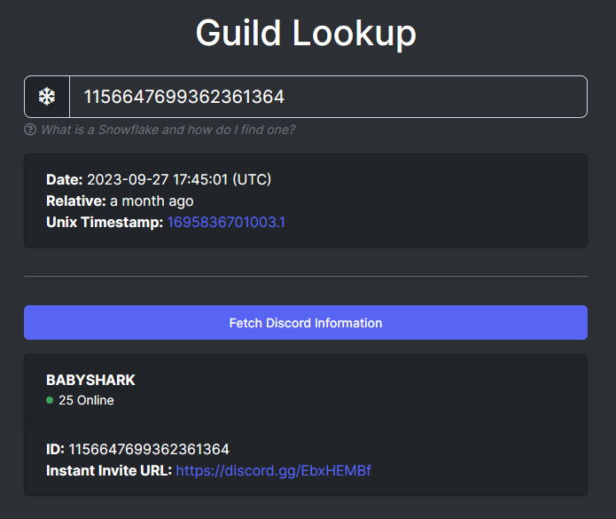
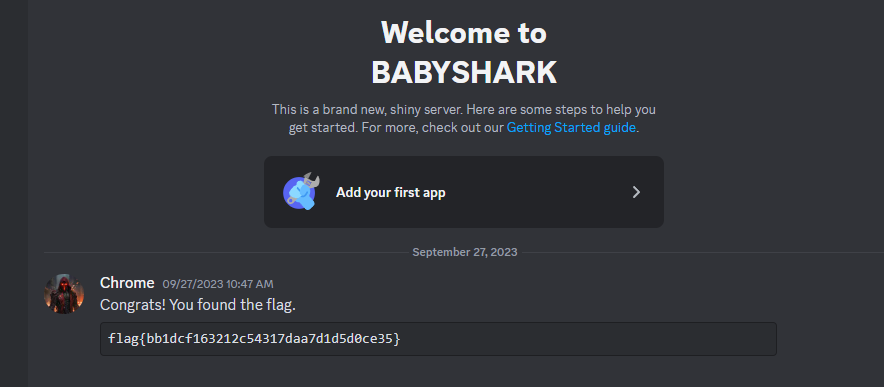

# ✅ MISCELLANEOUS - Discord Snowflake Scramble

Writeup by: [@goproslowyo](https://github.com/goproslowyo)

## Tags

- easy

## Description

Author: @Kaspertame

Someone sent  message on a Discord server which contains a flag! They did mention something about being able to embed a list of online users on their own website...  Can you figure out how to join that Discord server and see the message?  Note: Discord phone verification is NOT required for this challenge.  Connect here: https://discord.com/channels/1156647699362361364/1156648139516817519/1156648284237074552

## Writeup

We're given a discord URL. The first part of the URL is the Discord server ID.

This [website](https://discordlookup.com/guild/1156647699362361364/) will give you an invite to the server and you'll quickly find the flag.

