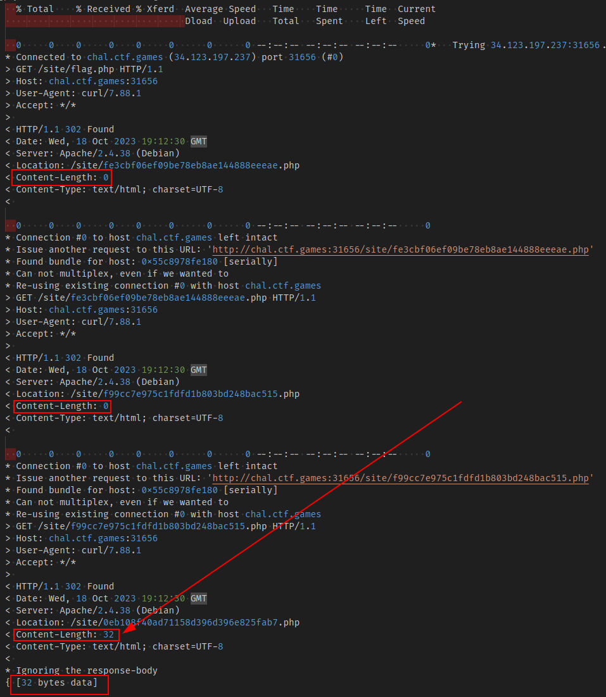

# ✅ MISCELLANEOUS - Indirect Payload

Writeup by: [@goproslowyo](https://github.com/goproslowyo)

## Tags

- medium

## Description

Author: @JohnHammond

We saw this odd technique in a previous malware sample, where it would uncover it's next payload by... well, you'll see.  Press the `Start` button in the top-right to begin this challenge.

## Writeup

When you visit the url the challenege gives you and click the button you are immediately redirected and then received a redirect loop error.

I started by doing the same thing in the command line analyzing the output:

```shell
$ curl --max-redirs 1000 -vL http://chal.ctf.games:31656/site/flag.php 2>&1 | tee out.log
[..]
```

In the log I noticed a pattern on some results with a Content-Length of 0 and others with 32. Checking on the first 32 byte result showed me a response body of: `character 0 of the payload is f`.



Okay. Now we know what to do. I extracted all responses with a non-zero length and made the requests in a quick loop:


Grad the flag text, format it properly, and submit:

`flag{448c05ab3e3a7d68e3509eb85e87206f}`
