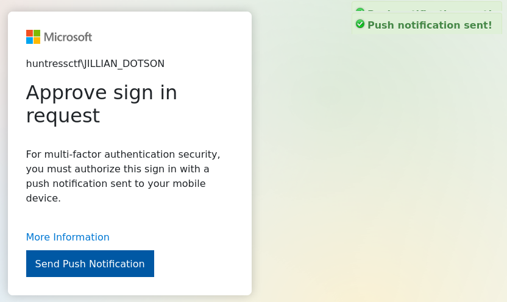

# ✅ MISCELLANEOUS - MFAtigue

Writeup by: [@goproslowyo](https://github.com/goproslowyo)

## Tags

- medium

Files:

- [NTDS.zip](./NTDS.zip)

## Description

Author: Adam Rice

We got our hands on an NTDS file, and we might be able to break into the Azure Admin account! Can you track it down and try to log in? They might have MFA set up though...  Download the file(s) below and press the `Start` button on the top-right to begin this challenge.

## Writeup

We're given an NTDS file and we can dump the NTLM hashes and then crack them. One or more will likely crack to point us in the next direction:

`impacket-secretsdump -ntds ./ntds.dit -system ./SYSTEM -hashes lmhash:nthash LOCAL -outputfile ntlm-extract`

Glancing at the challenge website, we probably want to look at domain user hashes.

There's two ways to approach this. Try to crack all hashes at once (fastest) in Crackstation or guess which account and crack just one hash (slower). This latter method is slower but you can figure out which account is not locked out.

Anyway, this is a CTF and the quicker way is to throw them all in Crackstation and pray and luckily `huntressctf\JILLIAN_DOTSON` cracks.

With the credentials `huntressctf\JILLIAN_DOTSON:katlyn99` we just need to login and as the challenge name suggests fatigue the MFA-holder into approving our authentication requests.

And get the flag:

`flag{9b896a677de35d7dfa715a05c25ef89e}`
