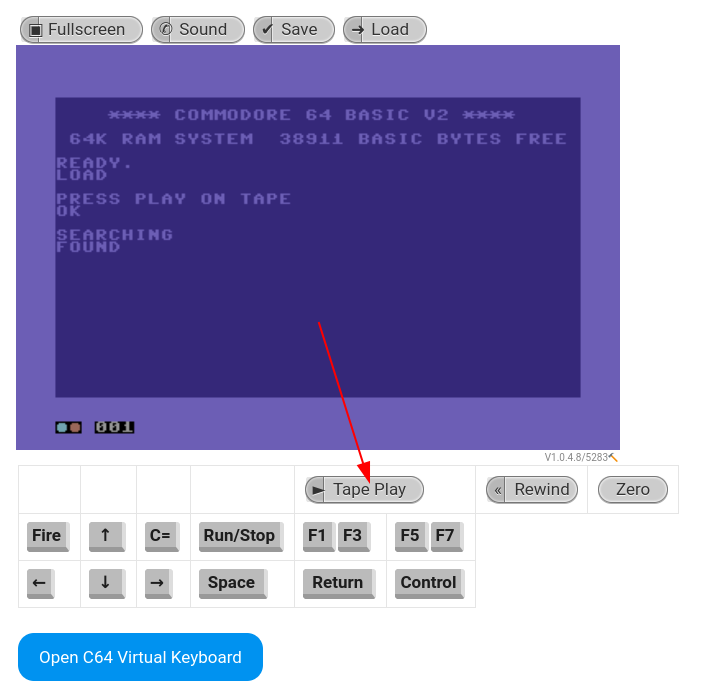

# ✅ MISCELLANEOUS - PRESS PLAY ON TAPE

Writeup by: [@goproslowyo](https://github.com/goproslowyo)

## Tags

- easy

Files:

- [pressplayontape.wav](./pressplayontape.wav)

## Description

Author: @daveAThuntress

While walking home through a dark alley you find an archaic 1980s cassette tape. It has "PRESS PLAY ON TAPE" written on the label.  You take it home and play it on your old tape deck. It sounds awful. The noise made you throw your headphones to the floor immedately. You snagged a recording of it for analysis.   WARNING: The audio in this file is very loud and obnoxious. Please turn your volume way down before playing.   Download the file(s) below.

## Writeup

This is a tape containing binary data in audio format that can be played on a commodore64.

Our first step is to convert the wave file to a tape file using `c64tapedecode`:

```shell
$ git clone https://github.com/lunderhage/c64tapedecode
[...]
$ cd c64tapedecode && make
$ ./wav2tap ../../pressplayontape.wav > ../../pressplayontape.tap
```

Now that we've got a Commodore 64 tape we need to find an actual Commodore 64... but this is 2023... so let's [find an emulator instead and insert the tape](https://c64online.com/c64-online-emulator/):





`flag{32564872d760263d52929ce58cc40071}`
