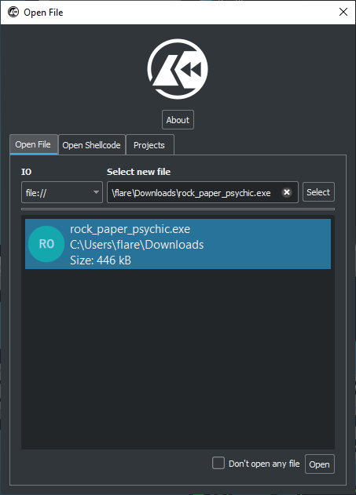
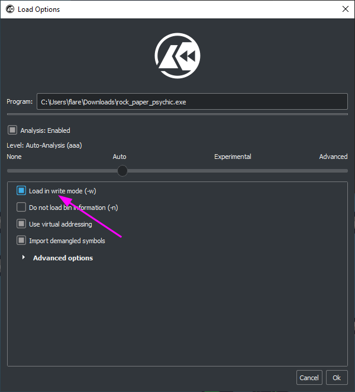
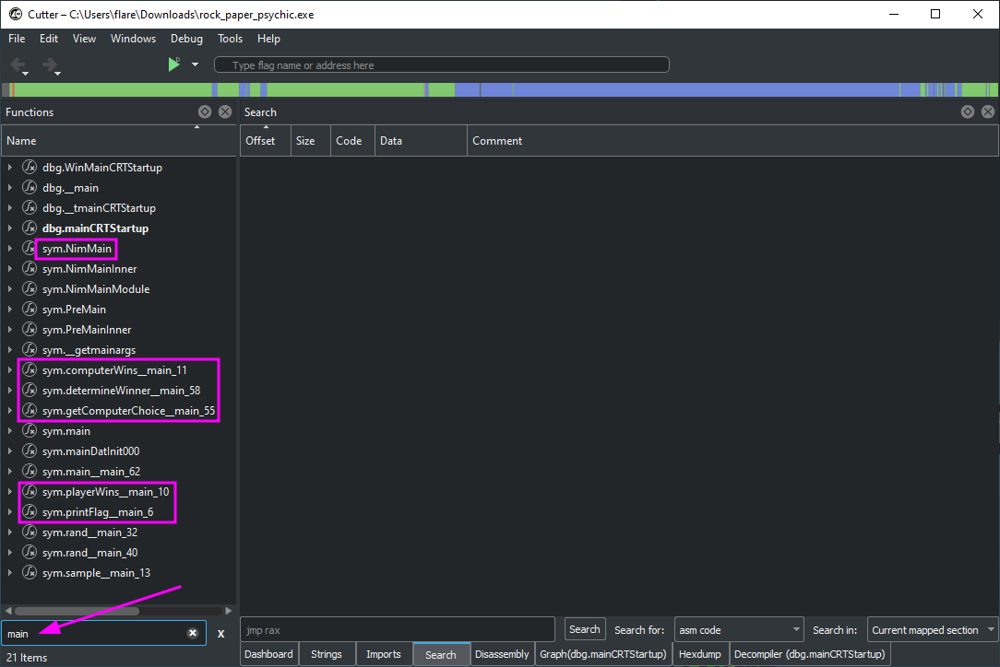
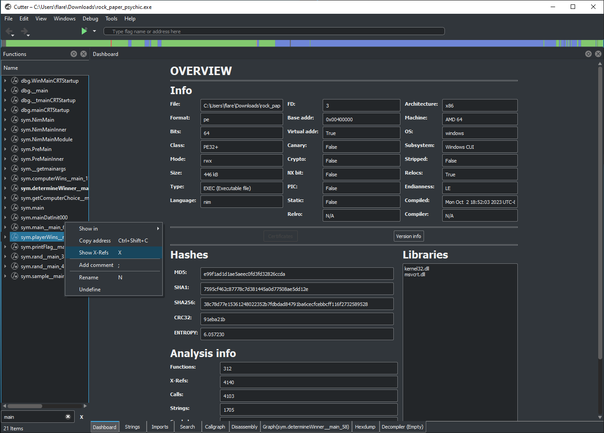
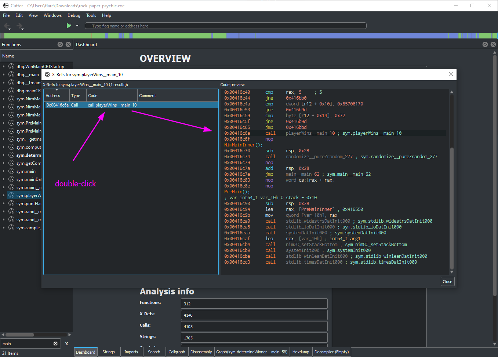
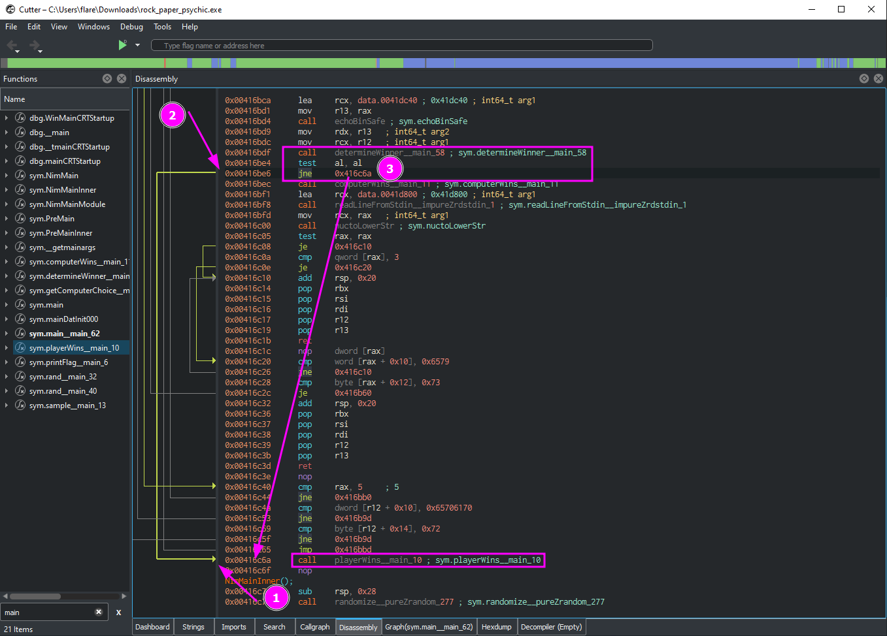
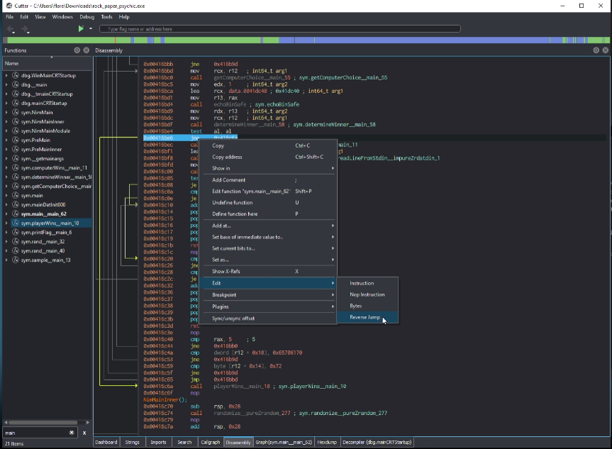
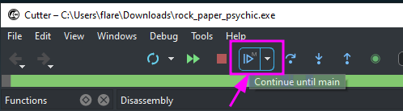
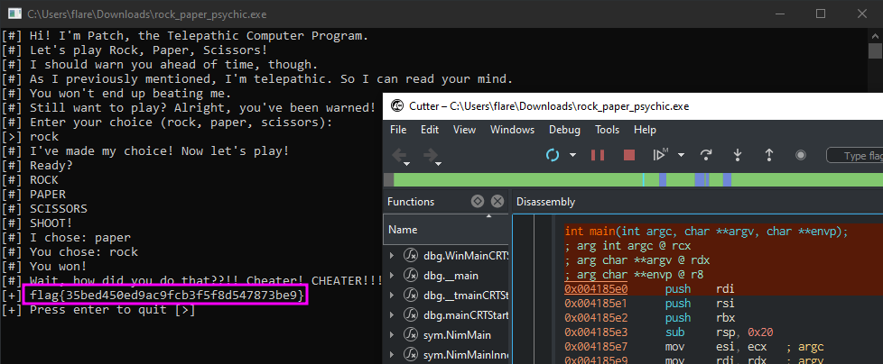

# ✅ MISCELLANEOUS - Rock, Paper, Psychic

Writeup by: [@goproslowyo](https://github.com/goproslowyo)

## Tags

- medium

Files:

- [rock_paper_psychic.7z](./rock_paper_psychic.7z)

## Description

Author: @HuskyHacks

Wanna play a game of rock, paper, scissors against a computer that can read your mind? Sounds fun, right? NOTE: this challenge binary is not malicious, but Windows Defender will likely flag it as malicious anyway. Please don't open it anywhere that you don't want a Defender alert triggering.Download the file(s) below.

## Writeup

This was a game of rock, paper, scissors against a computer that knows your every move. To beat it you'll have to be one step ahead!

To start, let's open the binary in Cutter and start digging around. Make sure to check the box to `Load in write mode (-w)` when opening. You'll see why soon enough.

Taking a look on the left hand side, if we search for `main` we can see a number of interesting functions like `NimMain` which tells us this is a Nim program (which, unfortunately while neat isn't relevant at all to solving this) and functions related to determining who won (`determineWinner`/`computerWins`/`playerWins`) and outputting the flag (`printFlag`).

Let's start at `printFlag` since that's the most interesting to us and work our way backwards until we get to a point in the code that branching instructions (if statements) are happening. This is useful because we can control the flow of code execution. Click on the `playerWins` function and then press `x` to show references (or calls to) this function.

Now, double-click on the `playerWins` function to jump to it in the disassembly.

Now we can trace the line on the left hand side to see which branching instruction leads to our `playerWins` call. We can see we're in the function `determineWinner` and that the code will jump to our `playerWins` functions if a certain condition is met. That condition is the `test al, al` right above it.

This tests the lower eight bits of the EAX register against itself via an exclusive or (XOR). If you're unfamiliar with XOR here's a quick truth table:

| A | B | A XOR B |
|---|---|:-------:|
| 0 | 0 |   0     |
| 0 | 1 |   1     |
| 1 | 0 |   1     |
| 1 | 1 |   0     |

If the two values being checked are equal the zero flag is set in the registers (i.e. the zero flag is set to 1). If not, it's unset (i.e. the zero flag is cleared, or set to 0). XOR is often used in conditional branching. Like in our example, XORing two registers and then checking the result with conditional jump instructions can be used to branch based on whether the two values are equal or not.

Well, now that we know how to get our flag let's try to reverse the outcome of the jne instruction. To do that, we can right click, go to edit, and choose `Reverse jump`. This is change the `jump if not equal` to a `jump if equal` allowing us to jump straight to our flag, regardless of our input or the psychic computer's choice.

Now that we've reversed the logic, the only thing left to do is run the program using the play button (or press `F9`) at the top of Cutter (you may need to press `Continue until main` a few times), play one round, and get our flag:

`flag{35bed450ed9ac9fcb3f5f8d547873be9}`
