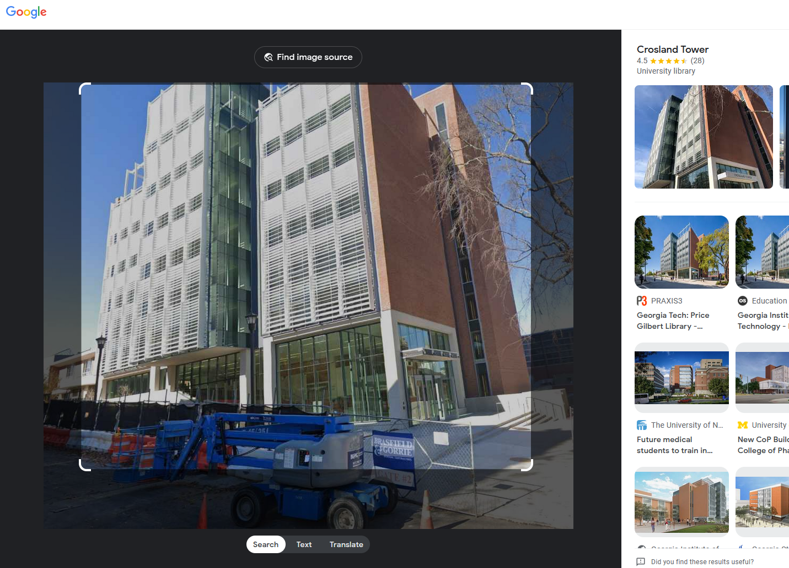

# ✅ OSINT - Operation Not Found

Writeup by: [@goproslowyo](https://github.com/goproslowyo)

## Tags

- medium

## Description

Author: @proslasher

In the boundless web of data, some corners echo louder than others,  whispering tales of innovation, deep knowledge, and fierce competition.

On the lush landscapes of https://osint.golf/, a corner awaits your discovery... where intellect converges with spirit, and where digital foundations stand alongside storied arenas.  This is the `chall1` challenge for the "HuntressCTF2023" challenges on https://osint.golf.  It's a lot like Geoguesser if you have ever played :)

Navigate to OSINT Golf and select the `chall1` challenge.

You will see an interface similar to Google Street View, where you can look around and zoom in on your surroundings. Try and determine your location on the map of the earth!

Move your mouse over the minimap in the bottom-right corner, and scroll to zoom or click and hold to pan around the map.

Click and place your pin-marker on the map where you believe your exact location is. The accuracy radius is 200 meters.

Click Submit. If you are incorrect, it will say "not here" on the top left. If you are correct, your flag will be displayed in the top-left corner.    Copy and paste the flag value into the input box below and submit it to solve this challenge!    Connect here: https://osint.golf/HuntressCTF2023-chall1/

## Writeup

This challenge was easy. Take a screenshot of the location shown and pop it into Google Images. I got the name of the building pretty quickly. Then it was a matter pointing to in on the osint golf webpage to get the flag.

This is the Crosland Tower at Georgia Tech in Atlanta, Georgia.

`flag{c46b7183c9810ec4ddb31b2fdc6a914c}`
