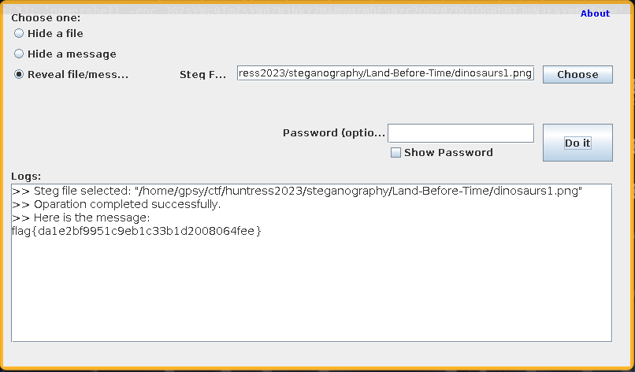

# ✅ STEGANOGRAPHY - Land Before Time

Writeup by: [@goproslowyo](https://github.com/goproslowyo)

## Tags

- easy

Files:

- [dinosaurs1.png](./dinosaurs1.png)

## Description

Author: @proslasher

This trick is nothing new, you know what to do: iSteg. Look for the tail that's older than time, this Spike, you shouldn't climb.   Download the file(s) below.

## Writeup

This challenge, as the description hints, requires the use of an esoteric tool called [iSteg (link)](https://github.com/rafiibrahim8/iSteg). Never heard of it but whatever the told us what to use so can't complain too much. Download the tool and run it on the image and you'll quickly find the flag.

`flag{da1e2bf9951c9eb1c33b1d2008064fee}`
