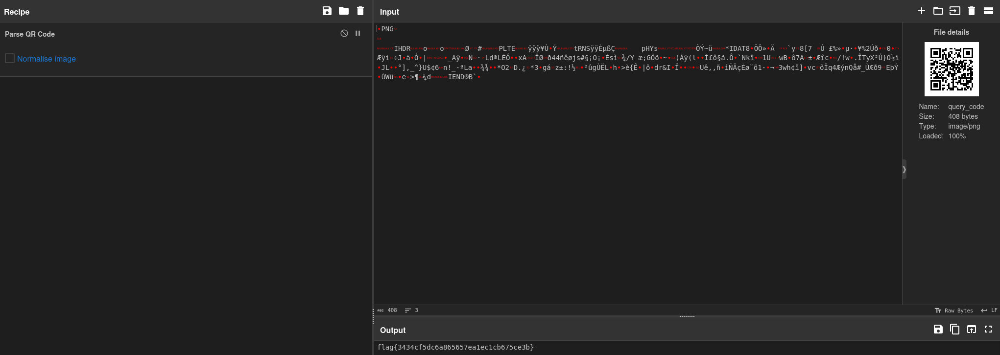

# ✅ WARMUPS - Query Code

Writeup by: [@goproslowyo](https://github.com/goproslowyo)

## Tags

- easy

Files:

- [query_code](./query_code)

## Description

Author: @JohnHammond

What's this? Download the file(s) below.

## Writeup

We're given a QR code which we can pass over to our faithful friend, [CyberChef](<https://gchq.github.io/CyberChef/#recipe=Parse_QR_Code(false)&input=iVBORw0KGgoAAAANSUhEUgAAAG8AAABvAQMAAADYCwwjAAAABlBMVEUAAAD///%2Bl2Z/dAAAAAnRSTlP//8i138cAAAAJcEhZcwAACxIAAAsSAdLdfvwAAAEqSURBVDiN1dS7kcQgDAZgeRw4WzegGdogoyW7gbW3gaUlMtrwjBswmQLG/2kf90qA5ILTkHwBAxIShF9B/4MH0RK3GUxkqkzI04CTeEEDA8/YFvA0NPHq%2BGpzI6ehT6GNyHPsEb4vWaDmO0fW9ZV%2BgRopwP8obIGHzaP0p%2BMu1IlgTmvulhYxVR4Dd0Kd9DdBA7GSxu5jnQAvIXeRLs5UeViz2n3Vve%2BMSkySl7BdLF9efVUkojYVbiFfLapMYZucvr6BmCpPMh5ELr8OKjOBZ%2BEOerE6Ib0Hj7L7Z9nLTIFogD7oe8qKfPSVZHImSZ3PjoUXnghV6iws8ZHs0cLnyPio9TEtnKwWM3doou5dnXZjA/XPcTTG/W5R5SNf2cbwOQtF/t2X%2B1f8AIhlHz62EbxkAAAAAElFTkSuQmCC>) and use the `Parse QR Code` recipe.

And then claim your flag: `flag{3434cf5dc6a865657ea1ec1cb675ce3b}`.
